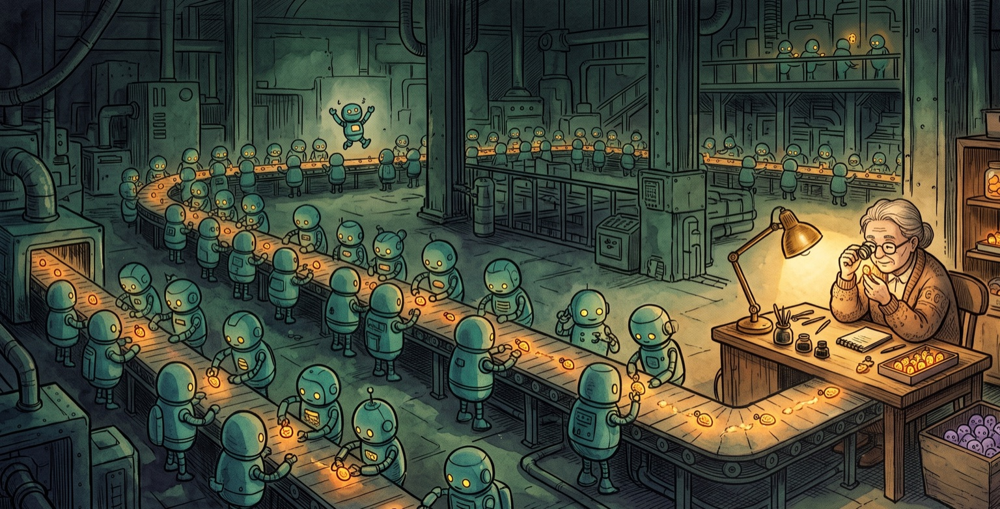

# AI Engineer World's Fair 2026: Takeaways & Verification

*By Jory Pestorious | San Francisco, July 6, 2026*

Your agent can ship the feature overnight. So can your competitor's. Last year I wrote that [engineering excellence = articulation excellence](https://jorypestorious.com/blog/ai-engineer-spec/): code had become a commodity, so the hard part moved to articulating exactly what should exist. This year the other shoe dropped. The spec didn't go away; it turned into the eval, a spec you can run. Writing good ones and running them at scale is the new hard part. Generating the work got cheap, and almost nobody can prove it's right fast enough to matter.

This was my second year at the World's Fair, the San Francisco flagship of an [AI Engineer series](https://www.ai.engineer/about) that now runs eight events across four continents. It ran [June 29 to July 2 at Moscone West](https://www.ai.engineer/worldsfair/2026), with 6,000+ engineers across 29 tracks. The conference was bigger, and the mood was stranger. Nothing is settled, there is no clear winner in models, harnesses, or interfaces, and the open field is exactly where the opportunity sits.

But we did find some answers again this year. Execution got fast and cheap, so the bottleneck moved to the one step nobody sped up: knowing the work is right. Once that's true, no single feature is scarce; the scarce thing is the system that produces and proves work faster than yours. That system is the factory, and the factory is the product. The factories mostly rent the same models, so raw generation converges. The floor is nearly the same for everyone. What diverges is what you build instead of rent: the verification stack, the context only you hold, and the taste. That is where competition lives now. Last year's equation didn't get replaced; it split. The judgment you can automate is verification, the judgment you can't is taste, and context is what both run on. That's the equation: engineering excellence = verification excellence + context + taste. The rest of this post is my thesis, built from trends I've been watching all year and what the conference stirred up.

## Foundation: Three Core Shifts

### 1. VERIFICATION (The Bottleneck)

I've been telling everyone that 2026 is the year of verification. Halfway through the year, the conference confirmed it: there was a whole track named Evals, another named Harness Engineering, and the expo floor was quietly one giant answer to "how do I trust this?"

The mechanism is Amdahl's law in action. When you speed up execution until it's nearly free, the bottleneck shifts to whatever you didn't speed up. Verification is the stubborn case. You can fan the checks out in parallel, and you should, but they all merge back into one serial decision: does this ship? That merge point stays slow no matter how many machines you add. Simon Willison, whose [Agentic Engineering Patterns](https://simonw.substack.com/p/agentic-engineering-patterns) project kicked off back in February, has a clear rule to follow: never assume generated code works until it has actually been executed. Of course we must extend that one level up: never assume the feature works until something has actually *used* it and evaluated it in context.

### 2. THE FACTORY (The Product)

The work is shifting up a level: your big idea is now workable, and your side project is a few prompts away, an observation [Theo Browne](https://t3.gg) made in one of the final keynotes. The factory that makes the product is becoming the real product of your company, and there was an entire track called Software Factories. So the question moves up too: what does your *system* for producing and verifying work look like?

### 3. TASTE (The Moat)

The machines don't have taste. When everyone ships at the same speed with the same models, judgment is suddenly worth more: vision, design aesthetics, brand intent, and knowing what *not* to build. And without that human-in-the-loop injection of taste and judgment at the right times, factories will often skew toward... weirdness or algorithmic uniformity. I'll say more on this at the end, because it's where I think the next moat is hiding.

## The Model Race Got Weird

Fable 5 is so sweet, and it's what I want to play with daily. But the bigger story is open weights. [GLM-5.2](https://docs.z.ai/guides/llm/glm-5.2) dropped mid-June: a 753B-parameter MoE with a solid 1M context, [MIT-licensed open weights](https://huggingface.co/zai-org/GLM-5.2), and among the strongest open models on coding benchmarks, sitting right behind the closed frontier. For the first time, an open model feels *feasible* at the top. The crowd in a Simon Willison session converged on an estimate: six months before an open model is the outright best at something that matters, not just the cheapest path to near-frontier.

**Why it matters:** MIT-licensed frontier-adjacent models change the math on cost, fine-tuning, and sovereignty. "Why are we paying 6x more" is now being asked in real meetings (let's go token VALUE maxxing).

**A caveat on everything below:** I lived in the agentic engineering, verification, and dev-tools tracks. Local AI, robotics, and world models had their own rooms, and I can't cover what I didn't see (a.k.a. I had difficulty acquiring the physical subagents required for additional verified context input generation).

## Year of Verification: The Evidence

### The Dark Factory Is Real

"Automate until you have a dark software factory" stopped being a metaphor this year. [Dan Shapiro coined the Dark Factory framing](https://www.danshapiro.com/blog/2026/01/the-five-levels-from-spicy-autocomplete-to-the-software-factory/), StrongDM's three-person AI team built one, and [Willison's writeup](https://simonwillison.net/2026/Feb/7/software-factory/) deserves your full attention. StrongDM's charter bans humans from both writing and reviewing code. Verification happens instead through a Digital Twin Universe: behavioral clones of Okta, Jira, Slack, and their other dependencies, so test scenarios can run at volumes production APIs would never allow. On top of that sits probabilistic "satisfaction testing" against holdout scenarios, treated exactly like an eval set. Their capacity benchmark: under $1,000 per engineer per day on tokens, and your factory has room to grow.

Skeptics admire the validation infrastructure and hate the no-review charter, especially for a security product. Both miss where the review went. Nobody abolished it; humans still maintain the twin, and a twin that drifts from the real Okta will happily verify your code against a world that no longer exists. The only check on the checkers is reality: production traffic, real users, and a human who owns the call.

### Cross-Model Review Went Empirical

The single best verification stat I heard on a stage: [Greptile analyzed several million PRs](https://www.greptile.com/blog/rise-of-the-overnight-agents) and found Claude Code 50% more likely than Codex to introduce auth-bypass vulnerabilities (1.5x the human baseline in their published tables, while Codex sits right at the baseline). None of that says "Claude bad." It says different models have different, *measurable* failure signatures. Which means the community habit of having one model write and a different model review just graduated from folklore to verified practice.

**If your factory runs on a single model end to end, you've built a monoculture, and monocultures share blind spots.**

### Open Source Is the Canary

The Linux kernel went from 2-3 security reports per week two years ago to 5-10 *per day* now (that's [Willy Tarreau's count, given on LWN in March](https://www.tomshardware.com/software/linux/linus-torvalds-says-ai-bug-reports-have-made-the-linux-security-mailing-list-almost-entirely-unmanageable)), and by May, Linus Torvalds was calling the private security list "almost entirely unmanageable." The kernel's own docs now tell researchers to treat AI-found bugs as effectively public, since the same tools surface the same bugs for multiple researchers within days. The arc matters: first AI slop, obviously wrong and easy to laugh at; then, in about a month, the reports turned real. Valid vulnerabilities now arrive faster than maintainers can process them; curl [killed its bug bounties entirely](https://lwn.net/Articles/1055996/) to cut the incentive. Verification capacity has become the limiting factor on an entire ecosystem's security. [Google's M-Trends](https://cloud.google.com/blog/topics/threat-intelligence/m-trends-2026) now puts mean time-to-exploit at *negative seven* days, with zero-day exploitation dominating the average. An exploit is a proof that runs itself. The attackers' verification loop is already dark, and negative seven is the gap between their loop and the maintainers'.

### Design-to-Code Still Isn't Solved

- **The results are humbling.** Every head-to-head I saw on the same Figma template landed in the same place: broad strokes right, pixels wrong. The mechanism is known, too: agents generate arbitrary values like `leading-[22.126px]` instead of your design tokens, then rationalize the drift as "visually matching." The working fix is token governance, not a bigger model: [Figma's Code Connect](https://developers.figma.com/docs/code-connect/) maps design components to your actual code components ("without it, the model is guessing"), and teams with real token hygiene report output that's nearly there. Drift is a systems problem wearing a model-problem costume.
- **Internal success is not external proof.** Frontier models are still unreliable at judging screenshots, even when they're zoomed and cropped one-to-one. Clicking around a web app through MCP is not the same as using the product.
- **Two layers of "using it," two toolchains.** For verifying *your own* app, DOM-driven loops beat vision-based computer use on reliability and cost in every comparison I saw, with a clean division of labor in [Steve Kinney's framing](https://stevekinney.com/writing/driving-vs-debugging-the-browser): [Playwright MCP](https://github.com/microsoft/playwright-mcp) drives a browser, [Chrome DevTools MCP](https://github.com/ChromeDevTools/chrome-devtools-mcp) debugs one. Install both and let the agent pick. For using the product *the way a user does*, on desktop, mobile, and beyond the browser, the fix is real computer use. Watch [Yutori](https://yutori.com): ex-Meta researchers training their own computer-use models, state-of-the-art on the major web-agent benchmarks, now shipping an [open frontend visual-QA tool](https://github.com/yutori-ai/frontend-visualqa) that acts as eyes for coding agents.
- **Drift is the new tech debt.** Context, guardrails, and docs all rot. Continuous verification of the *scaffolding* is the new maintenance work. What works for me: give the scaffolding its own agent. It's as simple as a weekly or monthly cron on documents that matter, one that re-verifies every link, price, and claim, then proposes diffs. The document maintains itself the same way the stack does.

> Execution is cheap. Proof is expensive. Budget accordingly.

Think like an automation engineer. Define what correct means for your system, constrain the machine until it can't wander, audit the security boundaries, and treat evals as the performance reviews that never stop. Count the human cost too. The context stack lives in your head as well as your repo, and cognitive overload is a team constraint, not a personal failing.

## The Factory Is the Product

If no single feature is scarce, the system that produces and proves work is. That's why the factory is the product, and its moats are these:

- **Context access.** Building, maintaining, and verifying context is becoming a business in many forms: personal wikis pulling in integrations, enterprise knowledge layers, and curated indexes. Whoever holds the context holds the leverage.
- **Ideaflow.** The idea person used to get laughed out of the room. Now the rate of good ideas entering your company, especially from the people who hold the context, is the bottleneck right after verification. Compete on ideaflow, not on copying features.

The clearest statement of the thesis came from the main stage. [Zach Lloyd of Warp argued that software engineering is becoming factory engineering](https://www.latent.space/p/aiewf-daily-dispatch-loops), and put the shift in one line: "You'll be building the thing that builds the product." Warp is acting on it, too: the company open-sourced its terminal and repositioned around [Oz](https://www.warp.dev/oz), a control plane that [orchestrates Claude Code, Codex, and Warp's own agent](https://www.warp.dev/blog/multi-harness-cloud-agent-orchestration) as interchangeable workers.

## Building the Factory

The factory needs three things: somewhere to run, something to know, and a way to watch it work. Here's the state of each.

### The Laptop Is a Thin Client Now

My most practical takeaway is simple: don't be afraid to shut your laptop.

**The cloud dev stack is here.** [Superconductor](https://www.superconductor.com/) is the best way I've seen to launch and review fleets of agents from your phone or Slack: every plan ships a QA Check Agent that double-checks work with Playwright, pricing is by the sandbox-hour, and connected Claude/ChatGPT plans respect your provider rate limits. [Cognition](https://cognition.ai) covers the autonomous-engineer side, and [Zo Computer](https://zo.computer) is the fully personal version, giving you a persistent Linux server with an always-on AI you can text (like [Hermes](https://hermes-agent.nousresearch.com/)). It's a whole spectrum, from a place to launch and steer agents to your entire computer living in the cloud.

**An underpriced observation: subscription portability is asymmetric.** A $20 ChatGPT subscription is now portable infrastructure: Codex backends power Zo, Hermes, and Superconductor alike, at least for now. A Claude Max subscription works only inside Anthropic's own surfaces and tools that run Claude Code under the hood; Anthropic revoked OpenCode's subscription OAuth back in January. In a world where the factory is the product, *whose subscription travels* shapes which agents the ecosystem builds on. Do I always want to be locked into one provider/harness with my subscription, or free to use a harness like [Pi](https://pi.dev/), a unique model, or the next big thing?

**Lock-in cuts both ways, and the field is organizing around it.** The frontier labs' harnesses are single-lab by design: Claude Code runs Claude, Codex runs OpenAI models, and Google [retired its open-source Gemini CLI in June in favor of the closed Antigravity CLI](https://developers.googleblog.com/an-important-update-transitioning-gemini-cli-to-antigravity-cli/). Around them, a layer of multi-provider tools sells the opposite promise, each at a different spot on the openness curve.

[Cursor](https://cursor.com) fronts Claude, GPT, Gemini, and Grok as a router while training its own [Composer line](https://cursor.com/blog/composer-2), which it [confirmed is built on Moonshot's open-weight Kimi K2.5](https://techcrunch.com/2026/03/22/cursor-admits-its-new-coding-model-was-built-on-top-of-moonshot-ais-kimi/) after a model identifier leaked. That's the open-weight play in one company: rent the frontier when you need it, own a cheap near-frontier for volume. Cognition plays aggregation: [Devin Desktop](https://cognition.com/blog/introducing-devin-desktop) bets on [ACP](https://agentclientprotocol.com) openness so your Claude Code and Codex sessions live inside *their* command center. And [Augment's Intent](https://www.augmentcode.com/blog/intent-a-workspace-for-agent-orchestration) does both at once: bring any agent you like, but the proprietary Context Engine underneath works best with Augment's own. The agent is swappable. The index it built of your codebase is what you'd have to leave behind.

And underneath all of it sit the genuinely open harnesses ([Cline](https://cline.bot), [opencode](https://opencode.ai), and [Kilo](https://kilo.ai)) plus open-weight subscriptions like [z.ai's GLM Coding Plan](https://z.ai/subscribe) that plug into a long list of tools, including Claude Code itself.

The practical stance: keep your workflows in portable conventions (AGENTS.md, MCP servers, skills as markdown, and git worktrees) and rent the intelligence on top. Do that and you can re-point the whole stack in an afternoon: the real leverage a buyer has while the labs and aggregators fight it out.

**But thin client requires secure-by-default.**

- The [Shai-Hulud](https://www.cisa.gov/news-events/alerts/2025/09/23/widespread-supply-chain-compromise-impacting-npm-ecosystem) npm worm should have ended the install-and-pray era. Its sequel compromised hundreds of packages and tens of thousands of repos within hours in November, and new waves were still landing this spring, hitting npm, PyPI, and Packagist simultaneously. Switching languages doesn't dodge the attack class; package-manager and network-layer defenses do.
- On [pnpm 11](https://pnpm.io/blog/releases/11.0) defaults, most of Shai-Hulud never touches you. The minimum-release-age cooldown means a version poisoned an hour ago doesn't get installed, and blocked install scripts mean the payload doesn't run even when one slips through. Add [`trustPolicy: no-downgrade`](https://pnpm.io/supply-chain-security), the only package-manager-level control I know of that catches a package's publishing trust *weakening* between versions, the exact signature of an account hijack. Turn it all on, everywhere, and stop running unguarded installs.
- Willison's ["lethal trifecta"](https://simonwillison.net/2025/Jun/16/the-lethal-trifecta/) is the mental model for agent risk: private data plus untrusted content plus external communication. Break at least one leg of that triangle, or assume breach. One leg now breaks by default: [Anthropic's own reference devcontainer](https://code.claude.com/docs/en/devcontainer) ships a default-deny egress firewall, so an unattended agent can't phone out to arbitrary hosts even if compromised code runs.
- One more leg-breaker I underrated: an allowlisted, curated search index ([Exa](https://exa.ai) was all over the conference) keeps the value of live retrieval while cutting the open web's prompt-injection and data-risk surface.

### Tokenmaxxing & the Knowledge Layer

There was a track named Tokenmaxxing, which shows where infrastructure attention has moved. The pattern I loved is simple: compile once, reuse everywhere, and re-verify on a schedule.

- **[Pinecone Nexus](https://www.pinecone.io/product/nexus/)** compiles your documents once into a knowledge layer agents can query, instead of re-reading and re-reasoning from scratch on every call. Never pay the model to rediscover the same answer twice. The lineage runs through Andrej Karpathy's LLM-wiki idea, Microsoft and Google are moving in parallel, and I want to build on this pattern as core infrastructure. Good news if you build on it; bad news if hand-rolled RAG was your moat. The retrieval tooling is turning into something anyone can rent. The data underneath is not: Nexus can compile anyone's documents, but it can't produce your codebase, your decisions, or your customer history. Rent the tools. The data no one else has is what protects you.
- **[Oracle AI Database 26ai](https://www.oracle.com/database/ai-native-database-26ai/)** runs relational, JSON, graph, vector, spatial, and text in one engine, in one query. Convergence is seductive, and databases are where seductive claims go to get expensive. The performance trade-offs got a lot less stage time than the reveal did, and a demo is an unverified claim with good lighting. Always ask what the convergence costs.

### Interfaces: ACP and the Agent Browser

Credit where it's due: [Zed](https://zed.dev/acp) *created* the Agent Client Protocol in 2025 in [collaboration with Google's Gemini CLI team](https://zed.dev/blog/bring-your-own-agent-to-zed), running the Language Server Protocol playbook. The result is an open, Apache-licensed standard that lets any agent plug into any editor. (Yes, the same Gemini CLI that got retired in June; the protocol outlived its launch partner.) Adoption is compounding: JetBrains across their IDEs, an ACP registry, and Windsurf relaunched as Devin Desktop on the strength of running any ACP-compatible agent. Agent-neutrality is becoming table stakes, because we're all juggling Codex, Claude Code, Augment Code, and friends, and the surfaces that speak to all of them win.

The bigger UI shift is that dev tools are evolving from CLIs into something like a browser with tabs, and the reason is this year's thesis in miniature. The CLI won the execution layer, but verification and taste are visual: you cannot see a rendered UI, annotate a screenshot, or watch eight agents run in parallel from a terminal. So the GUI is returning as a management and verification surface rather than an editing surface. You get many worktrees, many branches, quick visual review, and less cognitive overload. Most of these products, though, are converging on the same checklist: remote plus local, a memory DB, self-learning, and a GUI. The sameness is hard to ignore, and that convergence problem returns further down.

## Self-Learning Agents Arrived Early

Here's one I didn't expect to move this fast. Hermes Agent from Nous Research, "the agent that grows with you," hit 140K GitHub stars in under three months, is now the most-used agent on OpenRouter, and NVIDIA made it an officially supported harness in the [Nemotron 3 Ultra launch](https://developer.nvidia.com/blog/nvidia-nemotron-3-ultra-powers-faster-more-efficient-reasoning-for-long-running-agents/). The interesting part isn't the stars, though. It's the loop: after a complex task, the agent writes its own reusable skill file, then evolves those skills from real failure traces using [GEPA](https://arxiv.org/abs/2507.19457), a genetic prompt-optimization method that earned an ICLR 2026 Oral. It requires no GPU training, and it produces procedural memory that survives context resets. And the loop is gated: evolved variants must pass test suites and size limits, then land as pull requests for human review. That gate isn't paranoia: an [academic audit of 31,000 agent skills in the wild](https://arxiv.org/abs/2601.10338), OpenClaw's ecosystem included, found 26% contained at least one vulnerability. Self-written capability without verification is just supply-chain risk with better marketing. The human ended up reviewing skill PRs, the exact job the dark factory banned. The bottleneck didn't disappear; it moved up a level, where one approval covers every run that skill will ever make.

The team-scale version of the same idea is [Paper Compute](https://papercompute.com/), from GitHub veteran Brian Douglas and John McBride. It isn't an agent at all; it's infrastructure under whatever agents your team already uses, turning your best engineers' recorded sessions into shared, human-reviewed skills. The open-source [tapes](https://tapes.dev) records every request, response, and tool call as durable session data (there's a `tapes skill generate` command), and StereOS sandboxes what agents are allowed to do. Douglas frames the pair simply: tapes shows what happened, and StereOS makes sure it can't go further than it should. Individual learning becomes org learning, and the telemetry doubles as proof.

The third loop belongs to the labs. [Claude Managed Agents](https://www.anthropic.com/engineering/managed-agents), Anthropic's hosted harness, added a feature in May called dreaming: agents write notes to themselves, and later agents on the same code read them to avoid repeating old mistakes. That's procedural memory built into the platform itself, and it completes the set: Hermes is the individual loop, Paper Compute is the organizational loop, and Managed Agents is the platform loop, with your accumulated agent memory living in one lab's cloud. Which loop you build on is also a lock-in decision.

**Skills that write themselves, plus verification that gates them: that's the loop to watch.**

## Research Radar

Some research empowers these theses, and some threatens them.

- **[METR's time horizons](https://metr.org/blog/2025-03-19-measuring-ai-ability-to-complete-long-tasks/):** the length of tasks agents complete at 50% reliability has doubled roughly every 7 months for six years, and recent data trends even faster. Frontier horizons are now measured in hours, not minutes. The gap between 50% and 80% reliability *is* the verification burden, quantified. That gap is also a race, and capability doubles on a schedule while verification keeps pace only where someone industrialized it.
- **World models:** they had their own track this year for a reason. If post-transformer world models learn to predict environments directly, a chunk of today's screenshot-and-check stack becomes unnecessary. Verifying would still have to happen; the companies selling verification tooling are the ones threatened.

## Taste, Slop & the Algorithmic Uniclone

Taste is the part of the equation verification can't reach. A factory can prove the code does what the spec says; it can't tell you whether the spec was worth writing. And the line between them isn't clean: for the hardest checks, taste is the verifier, because nobody has an eval for whether a design is right. What the factories automate is the deterministic slice.

[Maximillian Piras](https://yutori.com/company/maximillian-piras) of Yutori put a name on the gap in one of my favorite sessions: **mousepower**. Watt had to invent horsepower before anyone could reason about buying a steam engine, and creative agent work has no unit like that yet. You can squint and see candidate shapes, though. Put a fleet of computer-use agents in front of your product as first-time users and measure how many finish the task without help, how long they take to first success, and how far they get before reaching for the docs. Core Web Vitals shows what happens once a unit sticks: Google wrote down three numbers for "fast," and frontend teams everywhere started building to them and getting judged by them. The first workable mousepower will do that to creative work.

There's a phrase I kept hearing, the **algorithmic uniclone**: AI design systems converging on sameness. You can often tell which model made a website now: a real problem for anyone trying to differentiate.

Here is a working definition of slop:

- **Low intent:** the output exists to fill space rather than to say something.
- **Poor fit:** it ignores the context you're actually working in.
- **Repetition:** the same structures and phrases recycle endlessly.
- **Convergence:** everything starts looking like everything else.

Nothing on that list is wrong. It's verified output nobody wanted, which is why no factory catches it.

The machines don't have taste, which is why humans stay in the loop. Whether taste can be trained in or only amplified is an open fight. [Taste Labs](https://tastelabs.com) came out of stealth June 16 with an $18.5M seed co-led by CRV and Amplify, betting it can at least be packaged and sold: founder Thais Castello Branco (ex-Exa) is selling preference data and evaluation rubrics from a vetted network of tastemakers who vouch for each other. Their contrarian claim is that standard preference-tuning has been *manufacturing* the very uniformity we're all complaining about: the average of many tastes is no taste at all.

Suppose the bet works and preference-tuning gets genuinely good. The moat survives anyway. A taste that gets encoded and sold is a taste everyone can buy, and a taste everyone has differentiates no one. Judgment gets more valuable either way.

We can't one-shot design. Start from the question that matters: what emotional territory should the user be in while using this? Plenty of software solves the problem and is still miserable to use.

The Amdahl logic doesn't stop here, either. Verification is getting its year of tooling, so the bottleneck moves again, into the checks only taste can run. Bottleneck and moat are the same thing seen from opposite sides.

## Game Feel: The Moat Nobody Is Building

Here's the hidden gold I didn't hear a single talk about, and it's what I want to build toward: **game feel**. Game designers have had a name and a whole book for this since 2008, when Steve Swink's *Game Feel* called it the hidden language of interaction. Software never really picked it up.

Think about Mario's triple jump in Super Mario 64. Run, jump three times with the right timing, and the third launches a huge front flip with a "Yahoo!" Most players discovered it by accident, just messing around in the castle grounds, because moving felt so good that you experimented for the joy of it. Nintendo shipped that in 1996, and thirty years later most software still can't make one interaction feel that alive.

When a competitor can rebuild your feature set with a frontier model in a day, why does someone choose *your* product? Because using it feels good. Imagine a dev tool where reviewing a PR and shipping to prod feels like hitting a perfect line in DDR. We need the UI/UX of the future, not this chat box: living, ambient interfaces that adapt as they absorb context and reward mastery.

Moats sort themselves by how hard they are to copy: features take a day, factories take a quarter, context has to accumulate, and feel can't even be measured. Anything you can write an eval for, someone else's factory can climb to. A DOM assertion can't tell you the jump feels good. Moats form exactly where verification can't follow.

Seamlessness is the work of our time, and almost nobody is thinking big about it. That's my bet for the next moat.

## Reality Check: What Actually Matters

**Humans still run the factory.** Engineers are motivated by different things: points in Jira, impact, curiosity, and/or money. If you can't motivate your team, you're the bottleneck, playing politics while the work rots. Too many teams are stuck re-litigating standards the industry already settled instead of building on them, and team dynamics are holding companies back more than tooling is. Culture starts from the top. If leadership enables the dysfunction, that dysfunction is the product.

**Value is still the point.** Building is easy now, and generating value is still hard. Who are you empowering? Who gets uplifted rather than just monetized? As building gets cheaper, get less greedy, not more, and start small with the people around you.

We all showed up on this planet as naked little babies, and everything since, the tools and the factories included, has been assembled from what the earth and those before us have made. So make helpful trinkets: charms, not curses. Make the ones that leave people smiling, not bound, tricked, or led astray. That's the one check no factory can run for you.

---

**TL;DR: engineering excellence = verification excellence + context + taste** ([last year's equation](https://jorypestorious.com/blog/ai-engineer-spec/) was articulation)

Execution is nearly free, so proof is the product. Build the factory, secure it by default, compile your context, and keep it current. Then differentiate on the one thing models can't generate: how it feels to use what you made. Nothing is settled yet, and that is good news.
