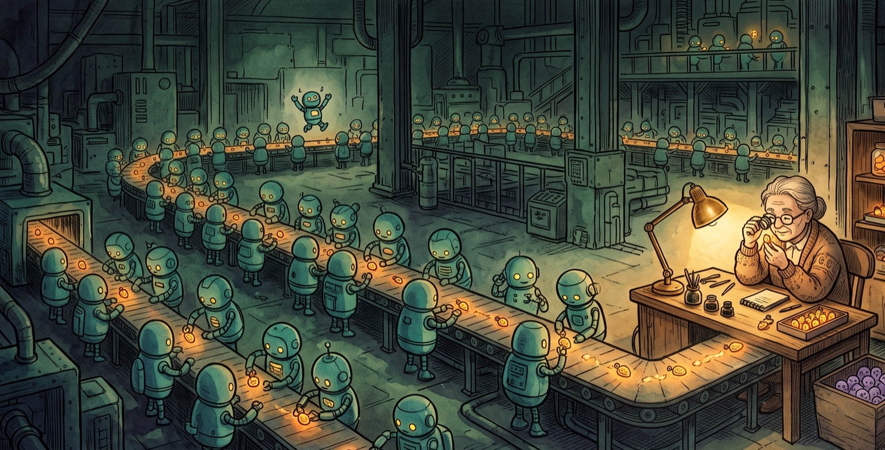

# AI Engineer World's Fair 2026: Takeaways & Verification

*By Jory Pestorious | San Francisco, July 6, 2026*

Your agent can build the feature, and your competitor's agent can too. Last year I wrote that [engineering excellence = articulation excellence](https://jorypestorious.com/blog/ai-engineer-spec/): once code became cheap, the hard part was saying exactly what should exist. At the 2026 AI Engineer World's Fair, the other shoe dropped. The spec became the eval, a spec you can run, because generated work is only useful when you can prove it works.

This was my second year at the World's Fair, the San Francisco flagship of an [AI Engineer series](https://www.ai.engineer/about) that now runs eight events across four continents. The event ran [June 29 to July 2 at Moscone West](https://www.ai.engineer/worldsfair/2026). The conference was bigger, the mood was stranger, and I did not leave with a clear winner among the models, harnesses, or interfaces.

I spent most of the conference in the agentic engineering, verification, and dev-tools tracks. Local AI, robotics, and world models had their own rooms, and I cannot cover what I did not see. I had difficulty acquiring the physical subagents required for additional verified context input generation.

I came home less interested in which model won than in the factory around it. The models and harnesses are becoming easier to rent. What diverges is what a company builds around them: verification, context, and taste. Last year's equation split into **engineering excellence = verification excellence + context + taste**. Verification is the judgment we can automate, taste is the judgment we cannot, and context feeds both.

## Proving the Work

I have been calling 2026 the year of verification. The Fair had a track named Evals and another named Harness Engineering. [Amdahl's law](https://dl.acm.org/doi/10.1145/1465482.1465560) describes why: when execution gets faster, the part that did not speed up determines the total time. Agent checks can run in parallel, but the results still return to a person or policy that decides whether the work ships.

[Simon Willison's Agentic Engineering Patterns](https://simonwillison.net/guides/agentic-engineering-patterns/agentic-manual-testing/) includes a practical rule: do not trust generated code until you have executed it. For a feature, I want a contextual test that runs the result as a customer would and shows where its behavior misses the spec.

[METR's time-horizon work](https://metr.org/blog/2025-03-19-measuring-ai-ability-to-complete-long-tasks/) tracks the length of tasks agents complete at 50 percent reliability. Its March 2025 study estimated a doubling time of roughly seven months over six years. The [May 2026 update](https://metr.org/time-horizons/) measures frontier horizons in hours and warns that estimates above 16 hours are unreliable with the current task suite. METR measures capability, not the labor required to verify it. My inference is that longer autonomous tasks leave teams with more output to validate before they ship.

### The Dark Factory Is Real

The dark software factory stopped being a metaphor. [Dan Shapiro described five levels of software automation](https://www.danshapiro.com/blog/2026/01/the-five-levels-from-spicy-autocomplete-to-the-software-factory/), ending with a factory that runs without humans writing the code. [StrongDM built one](https://factory.strongdm.ai/) with a three-person AI team whose charter bars humans from writing or reviewing the generated code. Its Digital Twin Universe supplies behavioral copies of services such as Okta, Jira, and Slack, so the factory can run test scenarios without production API limits. The factory also runs probabilistic satisfaction tests against holdout scenarios. [Simon Willison's account](https://simonwillison.net/2026/Feb/7/software-factory/) records the team's deliberately aggressive capacity target: spend at least $1,000 per human engineer per day on tokens.

The charter does not make review disappear. Review moves into the twin, the holdout scenarios, and the rules that decide whether an output passes. Someone still has to keep the twin aligned with the real services and compare its verdicts with production behavior. A stale copy of Okta can certify code against obsolete behavior.

### Cross-Model Review Gets Measured

[Greptile drew on data from several million reviewed pull requests](https://www.greptile.com/blog/rise-of-the-overnight-agents). Its April 2026 keyword search across review comments flagged auth-bypass language in pull requests attributed to [Claude](https://www.anthropic.com/claude) at 1.5 times the human rate per line of code, versus 1.0 for [Codex](https://openai.com/codex/). The rates are a comment-level signal, not confirmed vulnerabilities. They show that models can leave different, measurable review signals, which a team can test on its own codebase with one model writing and another reviewing.

### Open Source Shows the Triage Cost

[Linux kernel maintainer Willy Tarreau reported](https://lwn.net/Articles/1065620/) that the private security list went from two or three reports per week two years ago to five to ten per day in early 2026. Most of the new reports were correct, duplicate discoveries appeared daily, and the project added maintainers to handle them. The [kernel's security guidance](https://kernel.org/doc/html/next/process/security-bugs.html) now tells researchers to treat AI-assisted discoveries as public because the same bugs often surface across several researchers on the same day. Curl [closed the bug-bounty program](https://lwn.net/Articles/1055996/) because low-quality AI reports consumed too much maintainer time.

The tools found real bugs. The projects still had to reproduce each report, judge its impact, prepare a fix, and coordinate disclosure. [Google's M-Trends 2026](https://cloud.google.com/blog/topics/threat-intelligence/m-trends-2026) estimates mean time-to-exploit at negative seven days, which means exploitation routinely begins before a patch exists. Verification capacity now affects how quickly maintainers can turn a valid report into protection for users.

### Design-to-Code Needs More Than a Screenshot

The design-to-code comparisons I watched on the same template usually got the broad strokes right and the pixels wrong. Agents invented values such as `leading-[22.126px]` instead of using the design system, then described the result as a visual match. [Figma Code Connect](https://developers.figma.com/docs/code-connect/) addresses part of that problem by mapping design components to the real components in a repository. A larger model still lacks design tokens that the system never supplied.

I also do not trust a model's private judgment that a screenshot looks right. For my own web apps, DOM-driven checks have been more reliable and cheaper than vision-only computer use. [Steve Kinney separates the jobs](https://stevekinney.com/writing/driving-vs-debugging-the-browser): [Playwright MCP](https://github.com/microsoft/playwright-mcp) drives the browser, while [Chrome DevTools MCP](https://github.com/ChromeDevTools/chrome-devtools-mcp) inspects what went wrong. [Yutori's open Frontend VisualQA tool](https://github.com/yutori-ai/frontend-visualqa) adds screenshots and explicit visual claims, which helps a coding agent catch failures that DOM assertions miss.

The instructions around the code also need recurring checks. Context, guardrails, links, prices, and product claims all rot. I give important documents their own scheduled check that reopens every source and proposes a diff. The schedule removes the recurring search work, but I still decide whether the evidence supports the change.

## The Factory Is the Product

If no single feature is scarce, the system that produces and proves work becomes the advantage. The Fair dedicated an entire track to Software Factories. [Zach Lloyd of Warp argued that software engineering is becoming factory engineering](https://www.latent.space/p/aiewf-daily-dispatch-loops): "You'll be building the thing that builds the product." [Warp](https://www.warp.dev/) is acting on that view. Warp open-sourced its terminal and built [Oz](https://www.warp.dev/oz), a control plane that [orchestrates](https://www.warp.dev/blog/multi-harness-cloud-agent-orchestration) [Claude Code](https://code.claude.com/docs/en/overview), Codex, and Warp's own agent as interchangeable workers.

When an idea costs less to test, the people closest to the customer can contribute more than tickets. A model provider can sell the same model to every competitor. It cannot supply the customer knowledge that determines which ideas are worth testing.

### Open Models Make the Surrounding System Matter More

[GLM-5.2](https://docs.z.ai/guides/llm/glm-5.2) arrived in June with a 753-billion-parameter mixture-of-experts architecture, a one-million-token context window, and [MIT-licensed weights](https://huggingface.co/zai-org/GLM-5.2). On Z.ai's published coding benchmarks, it sits near the closed frontier. Its open weights let teams host or fine-tune it, making model portability a deployment choice.

### The Laptop Is Becoming a Thin Client

My practical takeaway is to stop being afraid to shut the laptop. Agent execution is moving off it. [Superconductor](https://www.superconductor.com/) launches and reviews remote agents from a phone or Slack. Its pricing page lists a Playwright-based QA Check Agent on every plan, though [the feature is still in private beta](https://www.superconductor.com/docs/implementation/qa-checks). Pricing is based on sandbox hours, and connected Claude and ChatGPT plans still use the provider's rate limits. [Zo Computer](https://zo.computer/) provides a persistent Linux server with an AI that accepts messages, closer to an always-on personal computer.

Subscription portability changes which tools I can combine. A [ChatGPT Plus](https://chatgpt.com/pricing/) subscription can power Codex inside [Zo](https://www.zo.computer/docs/codex), [Hermes](https://hermes-agent.nousresearch.com/docs/getting-started/quickstart/), and [Superconductor](https://www.superconductor.com/docs/agents/codex). [Claude Max](https://www.anthropic.com/pricing) can travel through Claude Code and [apps built with the Claude Agent SDK](https://support.claude.com/en/articles/15036540-use-the-claude-agent-sdk-with-your-claude-plan). I keep workflow rules in `AGENTS.md`, MCP servers, Markdown skills, and Git worktrees so a subscription or harness change does not take those rules with it.

### Unattended Agents Need Safer Defaults

Moving work into remote sandboxes also moves risk away from the screen where someone might notice it. [StereOS](https://stereos.ai/) runs coding agents inside disposable Linux VMs isolated from the host. CISA's [Shai-Hulud alert](https://www.cisa.gov/news-events/alerts/2025/09/23/widespread-supply-chain-compromise-impacting-npm-ecosystem) described a supply-chain compromise that spread through npm packages and harvested developer credentials. [pnpm 11](https://pnpm.io/blog/releases/11.0) now blocks dependency lifecycle scripts by default and supports a minimum-release-age delay. Its [`trustPolicy: no-downgrade`](https://pnpm.io/supply-chain-security) setting can reject a package version whose publishing trust is weaker than earlier versions.

[Simon Willison's "lethal trifecta"](https://simonwillison.net/2025/Jun/16/the-lethal-trifecta/) names three conditions that make an agent dangerous together: access to private data, exposure to untrusted content, and a way to communicate outside the system. [Anthropic's reference devcontainer](https://code.claude.com/docs/en/devcontainer) narrows the third path with a default-deny egress firewall. These controls do not prove an unattended agent is safe, but they reduce what compromised code can reach or send.

### Company Context Needs Its Own Infrastructure

The Fair even had a track named [Tokenmaxxing](https://www.ai.engineer/worldsfair/2026/llms-full.md). [Pinecone Nexus](https://www.pinecone.io/product/nexus/) compiles documents into a knowledge layer that agents can query instead of rereading the same sources on each call. Before adopting a layer like that, I want the source documents, access rules, and corrections to remain inspectable outside the retrieval service.

[Oracle AI Database 26ai](https://docs.oracle.com/en/database/oracle/oracle-database/26/nfcoa/vector-data-type.html) can combine vector similarity search with JSON, graph, text, spatial, and relational predicates in one SQL query. The conference presentation showed the convenience of that convergence, but not a comparison that would tell a buyer what it costs in latency, throughput, or price. I would need those measurements before choosing it over separate systems.

### ACP Separates the Agent from the Interface

[Zed created the Agent Client Protocol](https://zed.dev/blog/bring-your-own-agent-to-zed) in 2025 while working with Google's Gemini CLI team on its first reference implementation. ACP uses JSON-RPC to let an editor run an agent as a subprocess and render its work without parsing terminal escape codes. Zed released it under the Apache license, and the [current ACP ecosystem](https://zed.dev/acp) includes JetBrains IDEs, Visual Studio Code, Neovim, Codex CLI, Claude Code, Cline, and many other editors and agents.

The interface matters because execution is only part of the job. A CLI can run in the background while a GUI shows rendered pages, annotations, diffs, worktrees, and several agents at once. The GUI reduces the number of terminals and separate context windows I have to track. ACP lets the same agent keep its execution model while different clients compete on review and coordination.

### What “Self-Learning” Actually Stores

Self-learning agents arrived earlier than I expected, but the label hides several different loops. Reusable instructions create a different portability problem: an agent that rewrites a skill can carry one bad instruction into later sessions. I want that change saved somewhere I can inspect, test, and roll back.

[Hermes Agent](https://hermes-agent.nousresearch.com/) has a concrete reflection path: a [background review fork](https://github.com/NousResearch/hermes-agent/blob/2f74e29e3b1e9ce4c187a63fbc1432642e4b3486/agent/background_review.py) can create or patch reusable [`SKILL.md` files](https://github.com/NousResearch/hermes-agent/blob/2f74e29e3b1e9ce4c187a63fbc1432642e4b3486/tools/skill_manager_tool.py) from a conversation, so procedural notes survive a context reset. Nous' separate self-evolution repository experiments with [GEPA](https://arxiv.org/abs/2507.19457), a genetic prompt-optimization method that earned an ICLR 2026 Oral and does not train model weights. The [current execution path](https://github.com/NousResearch/hermes-agent-self-evolution/blob/0a929e3aa20e15cf04dc7c28492a7d41a5139125/evolution/skills/evolve_skill.py) exposes a `--run-tests` option, but neither validation call invokes [`run_test_suite`](https://github.com/NousResearch/hermes-agent-self-evolution/blob/0a929e3aa20e15cf04dc7c28492a7d41a5139125/evolution/core/constraints.py#L55). It saves local output instead of creating the [advertised pull request](https://github.com/NousResearch/hermes-agent-self-evolution/blob/0a929e3aa20e15cf04dc7c28492a7d41a5139125/README.md). An [open pull request](https://github.com/NousResearch/hermes-agent-self-evolution/pull/24) shows GEPA changing wrapper instructions instead of the skill itself.

Researchers [audited 31,132 skills from skills.rest and SkillsMP](https://arxiv.org/html/2601.10338v1) and flagged 26.1 percent for at least one potentially dangerous pattern. The authors warn that these are review flags, not confirmed malicious skills, and estimate the true prevalence at 23 to 30 percent after classifier uncertainty.

[Paper Compute](https://papercompute.com/) records agent sessions and turns selected patterns into shared skills. The open-source [tapes](https://tapes.dev/) project stores requests, responses, and tool calls as durable session data, and includes a `tapes skill generate` command. Tapes can generate a skill from named session IDs while retaining the underlying session traces.

[Anthropic's Dreams research preview](https://platform.claude.com/docs/en/managed-agents/dreams) reads an existing memory store and up to 100 past session transcripts. Dreams writes a separate store with duplicate memories merged, stale or contradicted entries replaced, and new insights added. The input stays intact, and future agents see the output only when a user attaches the new store. The separate output store makes consolidation inspectable, but the resulting memory still lives inside Anthropic's managed system.

Hermes puts reusable skills in the repository, Paper Compute turns recorded sessions into shared skills, and Dreams consolidates a managed memory store. Each leaves the learned state in a different place. Whether I can inspect, correct, and take that state elsewhere is part of the lock-in decision.

## Taste, Slop, and the Algorithmic Uniclone

Taste is the part of the equation verification cannot reach. A factory can prove that the code follows the spec; it cannot tell you whether the spec was worth writing. [Maximillian Piras](https://yutori.com/company/maximillian-piras) of Yutori called one missing measure [**mousepower**](https://www.ai.engineer/worldsfair/2026/llms-full.md). I can imagine a useful first version: put computer-use agents in front of a product as first-time users, then record completion rate, time to first success, and the points where they need documentation. [Core Web Vitals](https://web.dev/articles/vitals) made a similar move for web performance by defining three user-centered metrics. Mousepower would not measure taste, but it could turn some usability arguments into repeatable tests.

Several AI design systems I saw converged on the same visual language. I think of the result as the **algorithmic uniclone**: different products that reveal the same model defaults. A page can pass its functional tests and still fail in four ways:

- **Low intent:** the output filled space without saying anything.
- **Poor fit:** it ignored the product's context.
- **Repetition:** the same structures and phrases kept returning.
- **Convergence:** different products began to look interchangeable.

[Taste Labs](https://tastelabs.com/) came out of stealth on June 16 with an $18.5 million seed round co-led by CRV and Amplify. Founder Thais Castello Branco, previously at Exa, is building preference data and evaluation rubrics from a vetted network of tastemakers. The company's [research argument](https://tastelabs.com/blog/a-manifesto-for-judgement) is that standard preference tuning averages distinct tastes into the uniformity people now dislike. My concern is that customers could converge on the same vendor-supplied signal. Product teams still have to decide which signal fits them and where to depart from it. I want the first design question to be how a person should feel while using the product, because software can solve the assigned problem and still be miserable to use.

### Game Feel Is My Next Bet

The hidden gold I did not hear a talk about was **game feel**. Game designers already have a vocabulary for the moment-to-moment sensation of control. [Steve Swink's 2008 book *Game Feel*](https://shop.elsevier.com/books/game-feel/swink/978-0-12-374328-2) describes it in detail, but I rarely see developer tools treat interaction feel as engineering material.

Mario's [triple jump](https://www.nintendo.com/eu/media/downloads/games_8/emanuals/nintendo_8/Manual_Nintendo64_SuperMario64_EN.pdf) in [Super Mario 64](https://mario.nintendo.com/history/) is a compact example. Run and time three jumps correctly, and the third becomes a forward somersault. The move rewards rhythm and makes basic movement worth practicing for its own sake.

I want dev tools to care about that level of interaction. Reviewing a pull request and shipping it should feel closer to hitting a clean line in [DDR](https://www.konami.com/arcadegames/us/en/products/am_ddr.html) than filling out another form. A DOM assertion can confirm that the button worked. It cannot tell me whether the interaction invited mastery, reduced hesitation, or made the work satisfying.

## What the Factory Cannot Decide

A factory still has humans inside it. Engineers respond to impact, curiosity, recognition, and money in different proportions. Better agents do not remove the time lost when a team re-litigates decisions or leadership leaves conflicts unresolved.

Someone also has to choose the problem. Cheaper execution lets people who know the customer test more ideas, but the factory earns its keep only when those ideas remove a real burden without extracting more from the people they serve.

We all showed up on this planet as naked little babies, and everything since, the tools and the factories included, has been assembled from what the earth and those before us have made. So please make helpful trinkets: charms, not curses. Make the ones that leave people smiling, not bound, tricked, or led astray. That is the one check no factory can run for you.
