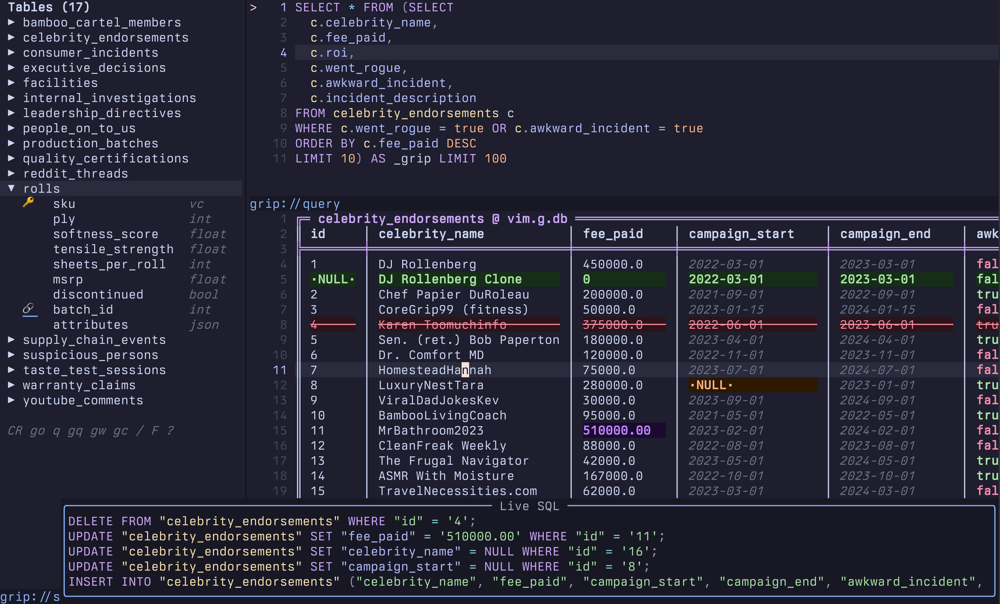

# Edit Database Tables Like Vim Buffers

**dadbod-grip brings the Vim editing model to database work: stage changes, preview the SQL, apply in a single transaction.**

*By Jory Pestorious | March 2026*

> 🔧 **Now Available**: [GitHub](https://github.com/joryeugene/dadbod-grip.nvim) | [Documentation](https://jorypestorious.com/dadbod-grip-web/)

<p align="center">
<br>
<sub><b>Chonk</b></sub>
</p>

## A Workflow in Your Hands

DataGrip is excellent. TablePlus is polished. VS Code has database extensions that work.

What none of them give you is a database workflow where every operation is one or two keystrokes away, with no mouse and no context switch required.

Open a table with Enter. Edit a cell with `i` and see the exact UPDATE statement in a floating preview before anything runs. Stage a delete with `d`. Apply every staged change in one transaction with `a`.

Filter the active column with `f` or build a compound filter with explicit operators using `gF`. Sort with `s`. Stack additional sort tiers with `S`. Copy the result set to clipboard in your choice of format with `gE`.

Open the full ER diagram with `gG`. Navigate it with `j` and `k`, cycle tables with `Tab`, and open any table directly in the editable grid with Enter. From the grid, follow a FK to the referenced row with `gf` and return with `<C-o>`.

View column statistics with `5`. Read the constraint list with `9`. Get the query execution plan in plain English with `gx`.

The sequence above covers a complete database investigation. Every step is one or two keys.

The Vim ecosystem had tpope's vim-dadbod for query execution and vim-dadbod-ui as a schema browser. Both are excellent at what they do. Neither treats row editing as a first-class operation, provides a navigable ER diagram, or exposes schema depth through these key sequences.

dadbod-grip does.

## The Core Idea

Open a database table. It renders as a grid in a Neovim buffer. Move with `j`/`k`/`h`/`l`. Press `i` to edit a cell. The row turns violet. A floating preview shows the exact UPDATE statement that will run. Stage more changes. Delete rows with `d` (they turn red). Insert a blank row with `o` (green). Clone an existing row with `c` (copies data, clears PKs, staged as a new INSERT). When you're ready, press `a` to apply the entire batch in a single transaction.

Nothing touches the database until you press `a`.

<p align="center">

</p>

```
:GripConnect    → pick a connection → schema sidebar + query pad open
<CR>            → open a table in editable grid
i               → edit a cell (row turns violet)
d               → stage a delete (row turns red)
o               → insert a new row (row turns green)
c               → clone current row as staged INSERT (PKs cleared)
gs              → preview the full SQL that will run
a               → apply all staged changes in one transaction
```

This is the Vim editing model applied to database work. Every motion works. Nothing installs outside Neovim. No Electron, no second window, no copy-paste circuit.

## What Makes This Different

### Mutation Preview

Before a single row changes in your database, you see exactly what SQL will run.

The `gl` keybind toggles a floating window that updates live as you stage changes. Press `gs` to see the full batch. The preview is not a summary. It is the actual parameterized SQL, identical to what the apply step will execute.

For query-pad mutations, it goes further: `<C-CR>` in the query pad stages the affected rows before executing. UPDATE rows appear teal, DELETE rows appear red, INSERT rows appear green. You see the impact before the transaction commits.

### Transaction Safety

Apply wraps all staged DML in `BEGIN`/`COMMIT` with automatic `ROLLBACK` on any error. You either get all your changes or none of them.

For cases where you apply and regret it, transaction undo reverses committed changes using compensating statements. The undo stack goes ten deep with confirmation. NULL values in typed columns restore as SQL NULL, not empty strings.

There is also a local staging undo stack, 50 levels deep, for undoing changes before you apply. Press `<C-r>` to redo. The two layers operate independently: local undo walks back staged changes; transaction undo reverses what already committed.

### More Editing Power

**Row cloning**: Press `c` on any row to duplicate it as a staged INSERT with primary keys cleared. Edit the PK fields, then apply.

**Visual batch editing**: Select rows in visual mode and set, delete, or NULL all of them at once. One keypress affects the whole selection.

**Conditional formatting**: Negative numbers render red, booleans render green or red, past timestamps render dimmed, and URLs render underlined. The grid gives you signal without requiring you to read every value.

**Column hide/show**: Press `-` to hide a column, `g-` to restore all hidden columns, and `gH` to open a visibility picker. Narrow wide tables to what matters without changing the query.

### ER Diagram

Press `4` (or `gG`) from anywhere in the workspace to open the ER diagram float.

The diagram arranges every table by FK depth using a tree-spine layout with box-drawing connectors. Tables at the root level appear at the top; dependent tables cascade downward. Each entry shows primary keys, foreign keys, and a column summary.

Navigate with `j` and `k`. Press `Tab` and `Shift-Tab` to cycle between tables. Press `<CR>` on any table to open it directly in an editable grid. Press `f` to follow a foreign key to its referenced table. Press `H` to go back. The breadcrumb trail updates as you traverse, so you always know where you came from.

The ER diagram is available from the grid, the query pad, and the schema sidebar. Press `gG` or `q` to close it.

### Depth Views on Every Table

Keys `4` through `9` open depth views of the current table from the grid, without navigating away:

| Key | View |
|-----|------|
| `4` | ER diagram (all tables, FK tree, navigate with j/k) |
| `5` | Column statistics (count, distinct, nulls, min/max, top values) |
| `6` | Column definitions (name, type, default, nullable) |
| `7` | Foreign keys (outbound and inbound, with referenced table) |
| `8` | Indexes |
| `9` | Constraints |

One keystroke to see everything about a table. No psql, no INFORMATION_SCHEMA queries, no leaving the workflow.

### Foreign Key Navigation

Press `gf` on any cell to follow its foreign key to the referenced row. The grid loads the referenced table, jumps to the matching row, and updates the breadcrumb trail. Press `<C-o>` to go back.

This is the same model as `:find` in Vim. Follow the reference, explore, come back.

### DDL from the UI

dadbod-grip handles schema changes without dropping to a terminal.

**Create table**: Press `+` in the schema browser or run `:GripCreate` to open an interactive column designer. Add columns, set types, define constraints, then confirm.

**Rename column**: Press `R` in the properties view (`:GripProperties` or `gI`) to rename a column with DDL preview and confirmation before the ALTER TABLE runs.

**Add or drop columns**: Press `+` and `-` in the properties view. Type prompts guide the column definition. Destructive operations require confirmation.

**Drop table**: Press `D` in the schema browser or run `:GripDrop`. It requires typed confirmation and shows CASCADE dependency warnings before the DROP TABLE executes.

### Built-In SQL Completion

dadbod-grip ships a `dadbod_grip` nvim-cmp source that registers automatically when nvim-cmp is present. No additional plugins or configuration required.

Completion covers table names, column names, SQL alias tracking, and keywords. It triggers while you type in the query pad or activates on `<C-Space>`. The source resolves against the active connection, including attached DuckDB catalogs.

### Cross-Database Federation

This is the feature no other Vim database tool has.

With DuckDB as a hub, attach any combination of Postgres, MySQL, SQLite, MotherDuck, S3 Parquet, and remote HTTPS files with `:GripAttach`. Then JOIN across all of them in a single query:

```sql
SELECT pg.customers.name, legacy.orders.total, cloud.analytics.ltv
FROM pg.customers
JOIN legacy.orders ON pg.customers.id = legacy.orders.customer_id
JOIN cloud.analytics ON pg.customers.id = cloud.analytics.user_id
```

Extensions install automatically. Attaching `postgres:` loads `postgres_scanner`. Attaching `sqlite:` loads `sqlite_scanner`. Attachments persist in `.grip/connections.json` and restore on reconnect.

```vim
:GripAttach postgres:dbname=production host=localhost user=me  prod
:GripAttach sqlite:legacy.db  legacy
:GripAttach md:cloud_analytics  cloud
```

### Files as Tables

Any file DuckDB can read opens as a live queryable table.

```vim
:GripOpen ~/data/report.parquet
:GripOpen https://example.com/dataset.parquet
:GripOpen s3://my-bucket/events.parquet
```

Write mode takes this further. `:Grip /path/to/data.csv --write` opens the file as an editable grid. Stage your changes. Press `a`. DuckDB writes the modified data back to disk in the original format. Parquet, CSV, TSV, JSON, NDJSON, and Arrow are all supported.

Watch mode keeps a grid live: `:Grip /path/to/data.csv --watch` re-runs the query on a timer and updates rows automatically. Default interval is five seconds. Watch pauses while you have staged changes so you never lose in-progress edits to a background refresh.

### Navigation That Behaves Like Vim

Surface navigation uses `1`-`9`. Each number has a primary action and a secondary action triggered by pressing it again:

| Key | Primary | Press again |
|-----|---------|-------------|
| `1` | Schema sidebar | Connections picker |
| `2` | Query pad | Query history |
| `3` | Grid / records | Table picker |

Keys `4`-`9` open depth views of the current table without leaving your context (ER diagram, column stats, column definitions, foreign keys, indexes, constraints).

Foreign key navigation works like a browser: `gf` follows a FK to the referenced row. `<C-o>` goes back. The breadcrumb trail updates as you traverse.

### Filtering and Sorting

Press `f` to open an inline filter prompt for the active column, or `<C-f>` to filter by any column value. Press `F` to clear all active filters. The status bar shows how many filters are active.

`gF` opens the column filter builder, which lets you compose filters with explicit operators: `=`, `!=`, `>`, `<`, `>=`, `<=`, `LIKE`, `NOT LIKE`, `IS NULL`, `IS NOT NULL`. The LIKE operator accepts `%` wildcards. Use `ROLL%` to match any value starting with ROLL. Press `gp` to save the current filter set as a named preset, and `gP` to load a saved preset. Presets persist in `.grip/` so the same filters are available every session.

Press `s` on any column to sort it. Pressing `s` again toggles between ascending and descending. Press `S` on a different column to add a stacked sort tier. Active sort columns show an indicator in the header.

### Analysis Built In

**Query Doctor** translates EXPLAIN plans into plain English with cost bars and index suggestions. Call it with `gx` or `:GripExplain`. You do not need to read query plans to understand what they say.

**Column profiling** via `gR` shows sparkline distributions, completeness, cardinality, and top values for every column in the table. Understanding your data shape takes one keypress.

**Data diff** via `gD` compares two tables by primary key with color-coded change highlighting. Useful for comparing snapshots, migration outputs, or environment differences.

**AI SQL generation** via `A` in the grid or `gA` in the query pad turns natural language into SQL. It reads existing query pad SQL and modifies it rather than generating from scratch. Schema context is cached per connection. Provider auto-detection uses `ANTHROPIC_API_KEY`, `OPENAI_API_KEY`, `GEMINI_API_KEY`, or local Ollama.

### Export

Press `gE` to copy the current result set to clipboard in one of six formats: CSV, TSV, JSON, SQL INSERT, Markdown table, or Grip Table (box-drawing). Press `gX` or run `:GripExport` to write to a file instead.

### Saved Queries and History

Press `:GripSave` to save the current query to `.grip/queries/` in the project directory. Load saved queries with `:GripLoad`. Named queries persist across sessions and are specific to each project.

Press `gh` or run `:GripHistory` to browse all executed queries with timestamps and SQL previews, stored in `.grip/history.jsonl`. Queries from all sessions are available.

Connection profiles save globally to `~/.grip/connections.json` and restore automatically. Connections added in one project appear in every project's connection picker.

## Getting Started

```lua
-- lazy.nvim
{
  "joryeugene/dadbod-grip.nvim",
  version = "*",
  keys = {
    { "<leader>db", "<cmd>GripConnect<cr>", desc = "DB connect" },
    { "<leader>dg", "<cmd>Grip<cr>",        desc = "DB grid" },
    { "<leader>dt", "<cmd>GripTables<cr>",  desc = "DB tables" },
    { "<leader>dq", "<cmd>GripQuery<cr>",   desc = "DB query pad" },
    { "<leader>ds", "<cmd>GripSchema<cr>",  desc = "DB schema" },
  },
}
```

Then `:checkhealth dadbod-grip` to verify your setup.

**Try the demo first.** `:GripStart` opens a preloaded SQLite database called the Softrear Analyst Portal: seventeen tables, a budget that does not add up, and a consumer incidents table with something in it that should not be there. No database connection required. The [walkthrough](https://jorypestorious.com/dadbod-grip-web/) covers the full investigation.

### Requirements

- Neovim 0.10+
- One or more database CLI tools in PATH: `psql`, `sqlite3`, `mysql`, or `duckdb`

No Node, no Python, no external plugins.

## Architecture

The design principle that makes staging work is immutable state. `data.lua` never mutates. Every edit operation returns a new state table. The plugin accumulates a diff between "original state" and "intended state" as pure data structures, generates SQL from the diff, and only executes at the I/O boundary (`db.lua`) when you explicitly apply.

This is why the mutation preview is always accurate. The SQL in the preview float is generated from the same diff that apply will execute. There is no translation step where something could diverge.

```
view.lua     (grid, UI, keymaps)
schema.lua   (sidebar tree, metadata, DDL)
query_pad    (SQL scratch, → results)
     │
ai.lua       (SQL generation, schema context)
diff.lua     (PK-matched comparison)
profile.lua  (sparkline distributions)
     │
data.lua     ← immutable state transforms
query.lua    ← query specs as plain values
sql.lua      ← pure SQL string generation
     │
db.lua       ← I/O boundary (shell commands, CSV parse, adapter dispatch)
     │
psql / sqlite3 / mysql / duckdb
```

## Compared to the Ecosystem

**vim-dadbod** is the foundation that dadbod-grip builds on top of. It handles query execution and connection management. dadbod-grip reads `g:db`/`g:dbs` for smooth migration.

**vim-dadbod-ui** is a tree browser with saved queries. It is good at showing you what exists in a database. It is not designed for editing rows, schema inspection, ER diagrams, or federation.

**TablePlus, DBeaver, DataGrip** are polished standalone clients. They are the right choice for teams that prefer a GUI and do not need keyboard-native speed.

dadbod-grip is the tool for people who do not want to leave Neovim to look at their data.

---

**Links:**
- [GitHub Repository](https://github.com/joryeugene/dadbod-grip.nvim)
- [Documentation](https://jorypestorious.com/dadbod-grip-web/)
- [Demo walkthrough](https://jorypestorious.com/dadbod-grip-web/)
