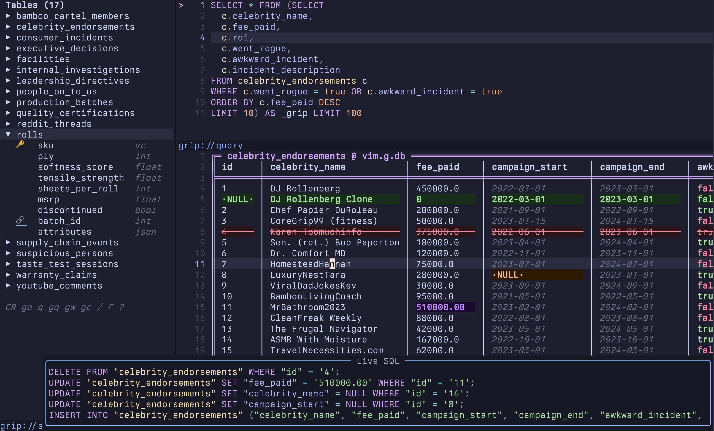

# Edit Database Tables Like Vim Buffers

**dadbod-grip v3.3.3 keeps database investigation inside Neovim while making row mutations visible before execution.**

*By Jory Pestorious | March 2026*

> **Now Available**: [GitHub](https://github.com/joryeugene/dadbod-grip.nvim) | [Documentation](https://jorypestorious.com/dadbod-grip-web/)

<p align="center">
<br>
<sub><b>Chonk</b></sub>
</p>

## Start With the Bad Roll

`ULTRA_BUDGET_XTRM` has a softness score of 0.0, a tensile strength of 2.1, and a `discontinued` flag set to false. It is the first bad fact in dadbod-grip's bundled [Softrear Analyst Portal](https://github.com/joryeugene/dadbod-grip.nvim/blob/d250cfdbcb7af47ba6142c034d9442bb6efbe40e/demo/softrear-internal.md), a fictional seventeen-table SQLite database built to exercise the plugin without touching a real system. It also has a consumer incidents table with something in it that should not be there.

The next query finds a severity 9 incident for the same roll: "Open floor plan. No music. The third floor is now the second floor people." Four foreign keys lead from that incident to a recalled production batch, a facility with a 3.2 vibe score, and a supplier called Bamboo Don whose relationship status is `embargo`.

I can investigate that chain without leaving one Neovim workspace. `<C-CR>` runs the query block under my cursor. `f` filters the grid by the current cell, `gf` follows a foreign key, and `<C-o>` returns to the prior table. `K` turns the current row into a vertical record, while `4` opens the complete entity-relationship map. The motion follows Vim's `:find` rhythm: follow the reference, explore, come back.

The same database makes the mutation path inspectable. I can open `rolls`, press `i` on the `discontinued` cell, and stage `true`. The row turns violet, but the database has not changed. `gs` shows the generated `UPDATE`; `a` sends the staged batch to the active database CLI.

<p align="center">

</p>

That path is why dadbod-grip exists. The records, relationships, and generated SQL stay in one workspace, with no copy-paste circuit between exploration and mutation. I wanted database work to feel keyboard-native and reviewable: follow the evidence quickly, then slow down where exploration becomes a write.

## The Mutation Stays Visible

The grid uses a small set of editing actions:

```
:GripConnect    -> pick a connection -> schema sidebar + query pad open
<CR>            -> open a table in an editable grid
i               -> edit a cell (row turns violet)
d               -> stage a delete (row turns red)
o               -> insert a new row (row turns green)
c               -> clone the current row as a staged INSERT (PKs cleared)
gs              -> preview the staged UPDATE / DELETE / INSERT statements
a               -> send the staged batch to the active database CLI
```

`gl` enables a floating preview that updates as I stage edits. Without that float, `gs` shows the pending batch on demand. Query-pad mutations use a separate parser. It can show affected rows for supported `UPDATE`, `DELETE`, and literal `INSERT` forms, but `INSERT ... SELECT` does not produce a reliable row preview. I review the statement itself when the parser cannot show its effect.

At the publication-era [`d250cfd` revision](https://github.com/joryeugene/dadbod-grip.nvim/tree/d250cfdbcb7af47ba6142c034d9442bb6efbe40e), [`data.lua`](https://github.com/joryeugene/dadbod-grip.nvim/blob/d250cfdbcb7af47ba6142c034d9442bb6efbe40e/lua/dadbod-grip/data.lua) returns a new top-level state for each edit and copies its mutable change collections. [`sql.lua`](https://github.com/joryeugene/dadbod-grip.nvim/blob/d250cfdbcb7af47ba6142c034d9442bb6efbe40e/lua/dadbod-grip/sql.lua) turns that state into escaped `UPDATE`, `DELETE`, and `INSERT` strings. The apply path in [`init.lua`](https://github.com/joryeugene/dadbod-grip.nvim/blob/d250cfdbcb7af47ba6142c034d9442bb6efbe40e/lua/dadbod-grip/init.lua) calls the same statement builders, adds `BEGIN` and `COMMIT`, and passes the script to the selected CLI adapter.

Shared builders keep the reviewed DML and the sent DML tied to the same staged state. They cannot guarantee that every CLI treats an error as an all-or-nothing batch. I reproduced that limit with SQLite: one valid `INSERT`, followed by an `INSERT` that violated a `NOT NULL` constraint, printed an error while the first row remained committed. dadbod-grip then kept the full staged batch because the CLI returned an error. Retrying that batch unchanged could repeat a statement that already ran.

I inspect the database after any apply error instead of trusting the rollback message. I also review the SQL and keep a real backup before changing data. The confirmation prompt does not provide either protection.

Local staging undo goes fifty changes deep, with `<C-r>` for redo. After an apply that the CLI reports as successful, dadbod-grip records up to ten batches of compensating statements. That second undo path is best effort: an autogenerated key can make an inserted row hard to identify later, and some CLI output cannot preserve the difference between `NULL` and an empty string.

## Follow the Record, Then Change It

The workspace has three main surfaces: `1` opens the schema sidebar, `2` opens the query pad, and `3` returns to the grid. Keys `5` through `9` replace the grid with statistics, column definitions, foreign keys, indexes, or constraints for the current table. Key `4` opens the full ER map. Its tree-spine layout arranges tables by foreign-key depth and shows primary keys, foreign keys, and a column summary. The map supports `j`/`k`, `Tab`/`Shift-Tab`, `<CR>` to open a table, `f` to follow a relationship, and `H` to move back through its breadcrumb trail.

Filtering follows the value under the cursor. `f` adds a filter for the current cell, `<C-f>` accepts a freeform `WHERE` clause, and `gF` opens a builder with operators including `LIKE`, `NOT LIKE`, `IS NULL`, `IS NOT NULL`, and `>=`. `gp` loads a saved filter preset; `gP` saves the current filters. `s` toggles the current column between ascending and descending, while `S` adds another sort tier.

The grid keeps several edits close to the record. `c` clones a row as a staged insert with its primary keys cleared. Visual mode can set, delete, or null several rows at once. Negative numbers render red, booleans render green or red, and past timestamps dim. `-` hides a grid column, `g-` restores hidden columns, and `gH` opens a visibility picker.

Schema work remains explicit. `:GripCreate` opens the table designer. In the properties view, `R` renames a column, `+` adds one, and `D` starts the drop-column flow. Dropping a table from the schema browser also uses `D`, requires typed confirmation, and shows dependency information before execution.

The analysis tools stay attached to the same table context. `gS` shows distinct values, nulls, min/max, and top values for the current column. `gR` profiles every column with completeness, cardinality, distributions, and top values where they apply. Query Doctor (`gx`) formats an `EXPLAIN` plan with cost bars and heuristic index suggestions, while `gD` compares two tables by primary key. `gE` copies the current result as CSV, TSV, JSON, SQL `INSERT`, Markdown, or Grip Table box drawing; `gX` writes an export file.

Saved queries live under `.grip/queries/` for the project. `:GripHistory` reads timestamped SQL from `.grip/history.jsonl`. Those files can contain query literals, and saved connection URLs in `.grip/connections.json` can contain embedded credentials. I keep `.grip/` out of version control and do not save passwords in connection URLs. SQL completion covers tables, columns, aliases, and keywords, with an optional `dadbod_grip` source for nvim-cmp.

The complete command surface is in the publication-era [keymap reference](https://github.com/joryeugene/dadbod-grip.nvim/blob/d250cfdbcb7af47ba6142c034d9442bb6efbe40e/KEYMAPS.md).

## DuckDB Connects the Edges

When the active connection is DuckDB, `:GripAttach` can add PostgreSQL, MySQL, SQLite, or MotherDuck catalogs to the session. The PostgreSQL and SQLite paths load their DuckDB scanner extensions as needed. Ordinary SQL can then join across those catalogs:

```sql
SELECT pg.customers.name, legacy.orders.total, cloud.analytics.ltv
FROM pg.customers
JOIN legacy.orders ON pg.customers.id = legacy.orders.customer_id
JOIN cloud.analytics ON pg.customers.id = cloud.analytics.user_id
```

```vim
:GripAttach postgres:dbname=production host=localhost user=me  prod
:GripAttach sqlite:legacy.db  legacy
:GripAttach md:cloud_analytics  cloud
```

`:GripAttach` updates the active session. When a DuckDB connection is saved in the project's `.grip/connections.json`, dadbod-grip records its attachments there and restores them on reconnect. That file stores the connection URL as written, so it belongs outside the repository and should not contain a password.

Files and HTTPS URLs enter through `:GripOpen`, not `:GripAttach`:

```vim
:GripOpen ~/data/report.parquet
:GripOpen https://raw.githubusercontent.com/plotly/datasets/master/2014_usa_states.csv
```

Local write mode accepts Parquet, CSV, TSV, JSON, NDJSON, and JSONL paths. `:Grip /path/to/data.csv --write` stages edits in the grid, asks for destructive confirmation, then has DuckDB rewrite the file. This is an export-and-overwrite path, not a promise to preserve every byte or serialization choice in the original file. HTTPS sources remain read-only.

Watch mode reruns a file query on a timer. `:Grip /path/to/data.csv --watch` uses a five-second interval, while `--watch=10s` changes it. The timer pauses when the grid has staged edits, so a refresh does not replace work waiting for review.

## AI Generates SQL, Not Approval

`A` from the grid or `gA` from the query pad sends a natural-language request with cached schema context to Anthropic, OpenAI, Gemini, or Ollama. When the query pad already contains SQL, the request includes that SQL and asks the provider to revise it. The result returns to the editable query pad; it does not bypass the normal run and review path.

The hosted-provider path sends table and column metadata, the request, and any existing query to that provider. The March implementation invokes `curl` with headers, the JSON request body, and the request URL in process arguments; the Gemini URL includes its API key. I do not use that path for a schema or query I am not authorized to disclose, and I do not treat the generated SQL as trusted. A local Ollama endpoint changes the recipient, but the same review requirement remains.

## Install the March Release

```lua
-- lazy.nvim
{
  "joryeugene/dadbod-grip.nvim",
  commit = "d250cfdbcb7af47ba6142c034d9442bb6efbe40e",
  keys = {
    { "<leader>db", "<cmd>GripConnect<cr>", desc = "DB connect" },
    { "<leader>dg", "<cmd>Grip<cr>",        desc = "DB grid" },
    { "<leader>dt", "<cmd>GripTables<cr>",  desc = "DB tables" },
    { "<leader>dq", "<cmd>GripQuery<cr>",   desc = "DB query pad" },
    { "<leader>ds", "<cmd>GripSchema<cr>",  desc = "DB schema" },
  },
}
```

dadbod-grip v3.3.3 requires Neovim 0.10 or newer and at least one database CLI in `PATH`: `psql`, `sqlite3`, `mysql`, or `duckdb`. AI SQL generation also requires `curl`. The plugin does not require Node, Python, or another Neovim plugin. If vim-dadbod is installed, dadbod-grip can read its `g:db` and `g:dbs` values as a compatibility path; query execution still goes through dadbod-grip's CLI adapters. vim-dadbod-ui remains a separate schema and query interface.

Run `:checkhealth dadbod-grip` to verify the local tools. Run `:GripStart` only from a disposable project directory: the command reseeds its demo database and deletes then recreates `<current-working-directory>/.grip/supplier_intel.db` when `sqlite3` is available. It opens the Softrear workspace and prints the walkthrough path.

At the pinned revision, the successful March 6 [GitHub Actions run](https://github.com/joryeugene/dadbod-grip.nvim/actions/runs/22752160056) started 29 spec files on both Neovim stable and Neovim 0.10.0. The DuckDB federation spec skipped because the runner did not install DuckDB; the other 28 files reported 682 passing assertions. That matrix exercises the state, SQL, adapter, UI, and regression paths behind this workflow, but it does not prove every database and CLI combination.

DataGrip, TablePlus, DBeaver, and VS Code database extensions still make sense when I want a separate GUI. dadbod-grip is for the investigation already happening in my editor. By the time I press `a`, I have followed the record and reviewed the generated SQL. The database CLI still decides what commits.

---

**Links:**
- [GitHub Repository](https://github.com/joryeugene/dadbod-grip.nvim)
- [Documentation](https://jorypestorious.com/dadbod-grip-web/)
- [Demo walkthrough](https://jorypestorious.com/dadbod-grip-web/)
