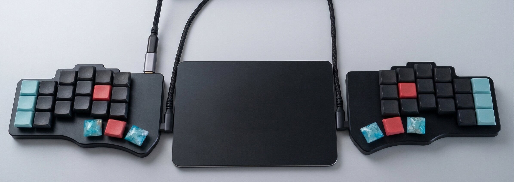

# Twelve Keyboards Later

**I bought 12 keyboards so you do not have to**

*By Jory Pestorious*

## Twelve Keyboards

At one point I owned a Piantor Pro, a CharaChorder, a CharaChorder Forge, a Starboard stenograph, a Kinesis Advantage, a Kinesis Advantage Pro, a Moergo Glove80, a Polyglot, an Alienware, a small Miryoku board from eBay, an HHKB Type-S, and a Keychron K2. That is twelve keyboards, twelve muscle memories, and twelve keymaps or layouts to maintain.

Two of those twelve stayed in regular use: the Piantor Pro and the Keychron K2. The MacBook keyboard, which came with the computer and was not one of the twelve purchases, became the third setup I kept. The other ten boards are getting sold or given away. The rotation produced two winning purchases and sent me back to one keyboard I already owned.

## How I Got Here

The progression felt rational one purchase at a time. A split board promised more freedom in shoulder and wrist position. Lighter switches changed how long typing felt comfortable. Chording promised whole words from simultaneous presses. Stenography offered another input system with a much larger training commitment.

Most purchases solved the problem that sent me shopping. Each also created a new problem: another layout, another configuration, or another piece of hardware to carry. The search stopped when I separated the physical qualities I could feel every day from the features I merely enjoyed configuring.

## What Mattered in My Rotation

**Split width.** At a desk, moving the keyboard halves to match my shoulder width made the largest physical difference for me. I also prefer some tenting and negative tilt, but those are adjustments, not medical guarantees. A [NIOSH-funded University of Pittsburgh grant report](https://stacks.cdc.gov/view/cdc/218902) compared one fixed split-angle Microsoft Natural keyboard with a flat standard keyboard; 85 people enrolled, and the posture analysis used data from 40. The fixed split keyboard reduced some non-neutral forearm and wrist positions, increased some non-neutral finger positions, did not reduce musculoskeletal discomfort, and received a lower usability rating. The report does not turn my preference into medical advice.

**Layers.** Reaching for the number row, arrow keys, or function keys interrupts my flow. A 42-key board with deliberate layers keeps those controls under my fingers. The Piantor Pro stores the layout in [Vial](https://get.vial.today/) firmware. On the MacBook, [Karabiner-Elements](https://karabiner-elements.pqrs.org/) provides the software equivalent.

**Light switches.** Nocturnal Silent Linear 20g switches are the lightest switches in my rotation, and they are the ones I prefer for long writing and coding sessions. That preference has a cost: my resting finger pressure can trigger a key, so the layout cannot depend on home-row keys doubling as modifiers.

I did not measure a productivity difference between ortholinear and staggered layouts, curved wells and flat PCBs, trackballs and touchpads, wired and wireless boards, or QWERTY and Colemak-DH. Those choices changed comfort, maintenance, and learning time. I stayed on QWERTY because moving to a columnar split board already required enough new muscle memory.

## The Three Setups I Kept

**Piantor Pro with Nocturnal Silent Linear 20g switches.** My desk keyboard is split, columnar, has 42 keys, and runs Vial firmware. It stays on the desk with the Mac touchpad centered between the halves. The two halves can move to my shoulder width, and the touchpad remains reachable by either hand.

**Keychron K2.** The Keychron stays with the gaming computer. The games I play need immediate access to number keys, F-keys, and Escape while other keys are held. A 75% board gives each of those controls a physical key. If I replace it, I would test Hall effect switches for adjustable actuation and Rapid Trigger rather than assume those features improve play.

For gaming, the mouse matters as much as the keyboard. I use a Logitech G Pro X Superlight because I can lift and palm it without extra side buttons changing my grip. A [DeltaHub Carpio](https://deltahub.io/products/carpio) slides under the heel of my mouse hand instead of pinning it to the desk. For professional work, I use the Mac touchpad. The trackballs I tried slowed as their bearings collected dust, and I got tired of cleaning them to restore the feel.

**MacBook keyboard with Karabiner.** The attached keyboard is my travel setup. macOS System Settings swaps Caps Lock and Ctrl so Ctrl sits on the home row. Karabiner maps Cmd+HJKL to arrow keys and makes the former Caps Lock position tap for Escape and hold for Ctrl. The MacBook is less comfortable for my longest sessions, but it requires no extra gear for meetings or coffee shops.

## The Piantor Layout

The keymap lives on the Piantor through Vial, so the layout follows the board to another computer. The rest of the software stack still needs to be installed on each Mac. My complete configuration is in [heavy-handed](https://github.com/joryeugene/heavy-handed/tree/2fd6893f9e5a6d9dd792a7e7238d135664e390ac).

Modifiers occupy the outer pinky columns: Ctrl at top left, Cmd at home left, Alt at top right, and Shift on both bottom keys. Six thumb keys handle five layers plus Backspace, Space, Tab, Escape, and mouse click. The right outer thumb taps Escape and holds Hyper, which is Ctrl+Shift+Alt+Cmd. The right inner thumb taps left-click and holds a mouse layer that moves the pointer with HJKL.

Home-row mods failed in this setup. With 20g switches, resting pressure and normal rollover produced accidental modifiers often enough to interrupt typing. Dedicated modifier keys removed the timing decision from the firmware: Ctrl is always Ctrl.

The inner-column keys at the T/G/B and Y/H/N positions stay blank on layers where I do not need them. Insert once lived on the G position of the navigation layer and fired constantly. Removing that binding fixed the mistake. The number and symbol layers still use the inner columns where I intend to reach them.

Holding Space puts tmux actions on the right hand for pane splits, zoom, lazygit, session selection, directory jumping, and yazi. Holding Enter puts [yabai](https://github.com/koekeishiya/yabai/tree/582161994b71e086bd777c3f0ee796bf2df7e0d5) window focus, swap, and resize actions on the left hand through HJKL. Holding the right outer thumb gives [skhd](https://github.com/koekeishiya/skhd/tree/a7105d5b3db6b25d01c0ded79a25536ab284b34f) a Hyper namespace for app launching. Alt belongs to windows, Ctrl+A to tmux, and Hyper to apps.

[Homerow](https://www.homerow.app/) adds letter labels to clickable and scrollable macOS elements. Hyper+J opens its click overlay, and Hyper+K opens scroll mode. Homerow is paid software with a free trial; it is not open source. Karabiner-Elements, yabai, and skhd are open source.

## What the Other Boards Taught Me

**HHKB Type-S.** The silenced Topre switches have a soft, rounded bottom-out, Ctrl already occupies the Caps Lock position, and the board requires almost no configuration. It lasted longer than most of the rotation. Plug-and-play has real value, but I missed the adjustable width of a split board.

**Kinesis Advantage and Advantage Pro.** The curved key wells felt substantial, and two coworkers later settled on the Advantage360 Pro and loved it. My older Kinesis boards lost to my preference for the Piantor's low-profile Choc switches. The wells changed the feel, but they did not make me type noticeably faster.

**CharaChorder and CharaChorder Forge.** The original board let me enter individual characters with directional switches or press letters together for whole-word chords. Some lateral motions were awkward for my pinky and ring fingers. The Forge reduced the thumb clusters from three switches per thumb to two, but its more sensitive switches made several chords hard for me to reproduce. Learning hundreds of chords demanded more practice than I wanted to give the hardware. The [CharaChorder X](https://www.charachorder.com/products/charachorder-x) adds chording to a compatible USB keyboard, and [virtchord](https://github.com/c2vi/virtchord/tree/6d6e3fd9fb3dfbec421f1724691f0c59c95c7e09) explores the idea in open source software.

**Moergo Glove80.** My Glove80 used Choc v1 switches, wireless halves, and 80 keys. I liked the switch family, but the case felt too light for my desk and the extra keys gave me more layout decisions than useful controls. The Piantor's 42-key limit forced clearer choices.

**Starboard stenograph.** Becoming useful with it required a training commitment I could not justify for programming. My bottleneck while coding was deciding what to write, not entering the characters.

**Polyglot.** Its hybrid layout was interesting to explore, but I never chose it for a normal workday. That was enough evidence to remove it from the rotation.

**Small Miryoku board from eBay.** Its home-row mods had the same timing problem I later removed from the Piantor. A smaller board can use other modifier strategies, but this particular layout made the firmware guess too often for the way I type. Forty-two keys give me dedicated modifier columns without adding a number row.

## If You Want the Desk Setup

The [Piantor Pro 42-key](https://shop.beekeeb.com/products/pre-soldered-piantor-split-keyboard) is the board I kept. Beekeeb sells Choc hotswap versions, so switches can be changed without soldering. The shop also offers a [Piantor Pro with an aluminum case](https://shop.beekeeb.com/products/piantor-pro-with-aluminum-case). I have not tested the aluminum case.

Start with software before buying hardware. Karabiner can put arrows on Cmd+HJKL, macOS can move Ctrl to the Caps Lock position, and skhd plus yabai can map window and app control. Hardware becomes relevant when adjustable split width, a columnar layout, low-force switches, or thumb keys solve a problem the software cannot.

## Voice Covers the Prose

[Wispr Flow](https://wisprflow.ai/) is what I use for dictation. In my own messages and documents, holding a hotkey, speaking, and releasing is faster than typing the same prose. I still review the output, especially around code terms and commands.

[Open Wispr](https://github.com/human37/open-wispr/tree/ce567f4f548e0fa8f501e7b7c435bbe9daa5c60a) provides a local alternative for Apple Silicon Macs. Its project documentation describes a Globe-key hold-to-speak interface, whisper.cpp transcription with Metal acceleration, local processing, and no account requirement. I have not run a controlled accuracy comparison between it and paid dictation products.

Voice does not replace my keyboard for programming. It handles Slack messages, pull request descriptions, commit messages, documentation, and email, while the keyboard remains better for code and precise editing. I wrote more about voice as an input layer in [Friction Economy: Unconscious Productivity Drains](/blog/friction-economy/).

## Or Use What You Have

The Alienware entered the rotation because I needed its hardware to program the Alienware SDK RGB lighting for [Totally Reliable Delivery Service](https://totallyreliable.com/), a game I worked on. It had a good volume knob, never failed, and never made me think about it. I helped ship a game called Totally Reliable Delivery Service, and yes, I mean the second word the whole time.

The Keychron K2 sounds like a hailstorm. The noise disappears during a game and becomes maddening during a writing session. The MacBook keyboard has a lighter touch, travels everywhere with the computer, and already does most of what I need after software remapping.

You do not have to spend the money. The endgame keyboard is the one where you stop thinking about keyboards and start thinking about the work.
