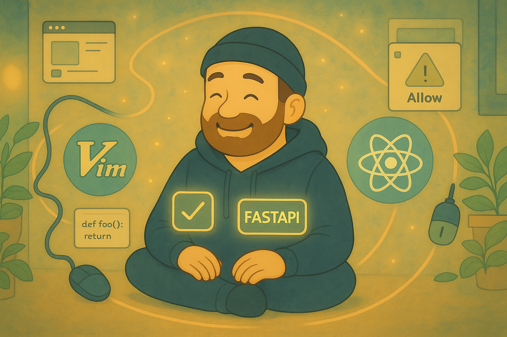

# Friction Economy: Unconscious Productivity Drains in Development Workflows

**How vi's constraint-driven design philosophy exposes the hidden time theft in modern development**

*By Jory Pestorious*

## Reading Guide

- **New to command line?** Start with "Prerequisites & Core Concepts" below.
- **Just want the tools?** Jump to "Quick Tool Reference" near the end.
- **Curious about the philosophy?** Continue reading--vi's story illuminates modern solutions.

## Prerequisites & Core Concepts

This post assumes basic familiarity with command-line interfaces and text editors. Here are key terms we'll use:

- **CLI (Command Line Interface)**: Text-based tool interaction, like Terminal or Command Prompt
- **Modal editing**: Separating typing from navigation modes (explained in detail below)
- **Pipe operator (|)**: Passes output from one command as input to another
- **Friction**: Any delay between intention and execution in your workflow

## Quick Start: Tools by Friction Type

| Your Pain Point | Solution | Install |
|-----------------|----------|---------|
| "I keep searching for that ChatGPT prompt" | [PromptHive](https://prompthive.sh) | `cargo install prompthive` |
| "cd ../../../ is killing me" | [zoxide](https://github.com/ajeetdsouza/zoxide) | `brew install zoxide` |
| "Git commands are so verbose" | [lazygit](https://github.com/jesseduffield/lazygit) | `brew install lazygit` |
| "Grep is too slow" | [ripgrep](https://github.com/BurntSushi/ripgrep) | `brew install ripgrep` |
| "Permission popups interrupt everything" | [CalmHive](https://calmhive.com) | `npm install -g calmhive-cli` |

Developers lose significant time to normalized micro-frictions--those small, repeated delays we've come to accept as normal: hunting for that ChatGPT conversation, copy-paste workflows between browser tabs, approving tool permissions. Each delay might only be seconds, but they compound across hundreds of daily interactions.

**The insight:** Constraints force innovation. Bill Joy's *vi* editor emerged from severe bandwidth limitations--300-baud modems (about 30 characters per second) that made every keystroke expensive. Rather than working around the constraint, he redesigned the entire interaction model. Today's micro-frictions reveal similar opportunities.

## What You'll Learn

This post explores how constraint-driven design philosophy can eliminate modern development friction. You'll discover:
- How vi's 1977 design principles apply to today's AI-driven workflows
- Specific tools that reduce prompt management, permission popups, and navigation friction
- Practical patterns for voice input, CLI automation, and keyboard-centric development
- Why the articulation bottleneck (the gap between thinking speed and typing speed) is our generation's 300-baud modem

The pattern repeats throughout development tooling. When faced with fundamental limitations, the most effective solutions create new interaction models rather than incrementally improving existing ones. This doesn't mean all optimization is wrong--but breakthrough efficiency comes from rethinking the entire approach.


*Developer in flow state surrounded by orbiting efficiency tools: vim, React, and optimized workflows create harmony while micro-frictions stay at a distance*

## Tools Overview

**Core Tools Featured in This Guide:**
- **[PromptHive](https://prompthive.sh)** (`ph`): CLI prompt manager for instant AI prompt retrieval
- **[CalmHive](https://calmhive.com)**: CLI wrapper for Claude Code with background processing and pre-approved tools
- **[zoxide](https://github.com/ajeetdsouza/zoxide)** (`z`): Smart directory navigation that learns your habits
- **[ripgrep](https://github.com/BurntSushi/ripgrep)** (`rg`): Fast code search respecting .gitignore
- **[lazygit](https://github.com/jesseduffield/lazygit)**: Visual git interface with keyboard navigation

## The 1977 Solution

### What is vi? A Quick Introduction

Vi introduced **modal editing**--separating typing from navigation modes. Instead of always being in "typing mode," the keyboard becomes a control surface where every key performs an action. This seems odd until you realize most editing isn't typing new text--it's navigating, changing, and rearranging existing text.

### The Bandwidth Crisis

Bill Joy created *vi* in October 1977 to edit text over a 300-baud modem¹. At 300 baud--roughly 30 characters per second--interface response was painfully slow. Joy described it as *"painting slower than you could think."* Every keystroke traveled through phone lines. Updating the display cost precious bandwidth.

He invented modal editing, separating typing from navigation. In Normal mode (the default), the keyboard became a control surface where every key performed an action:

- **Basic navigation**: `j` moved down, `k` up, `h` left, `l` right
- **Efficient movement**: `$` jumped to end of line (vs. dozens of right arrows), `0` to beginning
- **Word jumping**: `5w` moved five words forward, `3b` three words back
- **Line jumping**: `5j` moved five lines down instantly (vs. five separate `j` presses)
- **Text objects**: `ci"` changed everything inside quotes ("change inside quotes"), `da(` deleted around parentheses ("delete around parentheses")
- **Search navigation**: `/function` jumped to next occurrence, `*` found word under cursor
- **Bookmarks**: `ma` marked position 'a', `'a` jumped back instantly
- **Macros**: `qa` started recording actions, then you'd perform edits, `q` stopped recording, `@a` replayed those exact keystrokes again wherever needed

Each command compressed multiple operations into minimal keystrokes. No mouse overhead. No arrow key reaches.

Moving your hand to a mouse takes around 400ms² (nearly half a second). Character-by-character navigation takes seconds where semantic commands take milliseconds. Consider: moving to the end of a long line character-by-character might take 3-4 seconds, while `$` is instant. These delays multiply across thousands of daily micro-movements.

Joy's breakthrough was **semantic compression**--encoding complex intentions into minimal keystrokes. Instead of "move cursor right 15 times then delete 5 characters," you'd type `dt.` ("delete to period"). Instead of hunting for a matching bracket, `%` jumped directly there. `ciw` ("change inner word") replaced an entire word. Joy didn't optimize screen updates--he eliminated them through semantic efficiency.

Think of it like the difference between giving turn-by-turn directions versus saying "go to the coffee shop." One requires many instructions, the other captures intent directly.

These patterns remain effective because the efficiency advantage persists. Vim often requires fewer keystrokes for common editing tasks compared to traditional editors.

## Speed Patterns in Modern Tools

Modern applications increasingly adopt keyboard-first navigation:

- [Superhuman](https://superhuman.com) builds entirely around keyboard shortcuts--no mouse needed for email management
- [Linear](https://linear.app) uses single-key shortcuts throughout (c for create, g+i for inbox, l for labels)
- [Todoist](https://todoist.com) enables j/k navigation, e to complete tasks, and 1-4 for priority levels

These tools recognize that keyboard navigation often outperforms mouse interaction for power users. The efficiency gains from *vi*'s **semantic compression** remain relevant.

## Modern Development Friction: Where Vi's Principles Apply Today

### The Connection: From 1977 to Now

Just as vi's semantic compression solved 1977's bandwidth constraints, today's development workflows suffer from different but analogous friction points. The constraint has shifted from bandwidth to cognition--we think faster than we can interact with our tools.

Common friction sources in modern development:
- Deep directory navigation (`cd ../../../auth/services/validation`)
- Hunting for AI prompts across ChatGPT conversations
- Repetitive tool permission approvals
- Verbose git command syntax
- Manual search through large codebases

Each delay compounds across hundreds of daily interactions.

**The Friction Economy:** Every workflow has friction--delays between intention and execution. Some friction is necessary (security checks, code review). But much is accidental, normalized through repetition. Each friction point below represents an opportunity to apply vi's core principle: **encode intention, not action**.

**The pattern**: Instead of optimizing within current paradigms, identify the underlying constraint and redesign the interaction model.

### 1. Interface Paradigm Friction: GUI vs Keyboard-First

**Current workflow**: Click through interfaces, move mouse between elements, hunt for buttons, navigate menus.

**Keyboard-first approach**: Direct commands, semantic shortcuts, minimal visual scanning.

Modern tools increasingly adopt this pattern: Raycast, Superhuman, Linear all prioritize keyboard navigation over mouse interaction.

### 2. Prompt Management Friction

**Current workflow**: Open ChatGPT, scroll through conversations, find the prompt, copy it, switch tabs, paste, edit, copy response, switch to editor, paste.

**Streamlined approach with [*PromptHive*](https://prompthive.sh)**:

[*PromptHive*](https://prompthive.sh) is a command-line tool that stores your AI prompts locally for instant retrieval. Think of it as a prompt library with semantic shortcuts. Instead of hunting through ChatGPT conversations, you access prompts instantly:

```bash
ph use debug "timeout error in auth service"
# Retrieves prompt template, substitutes variables, copies to clipboard (~8ms)
```

**Key behavior**: `ph use` copies to clipboard when standalone, pipes output when chained (`ph use debug | claude`).

Compare this to the typical workflow: open ChatGPT, find the conversation, scroll to the prompt, copy it, switch tabs, paste and edit. That's significant time reduced to ~8 milliseconds.

### 3. The Permission Popup Plague

**Current workflow**:
- *"Python wants to access your documents"* → Click Allow
- *"Terminal wants to run a script"* → Click Allow
- *"Node.js wants to access your files"* → Click Allow
- Repeat for each tool

Each permission popup interrupts focus.

**Pre-authorization approach**:
```bash
# Pre-approve specific tools for Claude Code CLI
# This tells Claude which tools it can use without asking permission
claude --allowedTools "Bash,Read,Write" -p "run cargo test and fix any failing tests"

# Or start an interactive session with pre-approved tools:
claude --allowedTools "Read,Write,Edit,Bash"
# Now Claude can read files, write code, edit, and run commands
# without interrupting you for permission each time
```

[*CalmHive*](https://calmhive.com) is an AI automation tool that runs Claude sessions in the background with pre-configured permissions. It automatically passes the allowed tools parameter to every Claude instance, pre-approving MCP tools (Model Context Protocol--the standard for AI tool interactions).

Why this matters: The dangerous `--dangerously-skip-permissions` flag bypasses all permission checks. CalmHive instead specifically approves only the tools you need, maintaining security while eliminating interruptions. This enables unattended AI workflows without constant permission popups.

Define permissions once. Work without interruption.

### 4. The Articulation Bottleneck

Our internal monologue runs at approximately 400 words per minute⁴ (when we're thinking fluently) while typing averages 40-80 wpm. This 5-10x gap between thinking speed and expression speed creates significant friction--it's like having a high-speed processor connected to a dial-up modem.

Recent Caltech research quantifies this precisely: conscious thought operates at 10 bits per second while sensory systems process 1 billion bits/second. Your brain compresses thoughts by 100 million-fold before expression.

#### The Stenography Parallel

Before voice, humans already solved the typing speed bottleneck. Professional stenographers achieve 225+ words per minute⁵, with Mark Kislingbury holding the world record at 360 WPM with 97.23% accuracy. Stenotype machines use chord-based input: multiple keys pressed simultaneously to capture entire syllables or words.

Like vi's modal editing, stenography transforms constraint into efficiency through semantic compression: fewer physical movements, more semantic actions. Yet voice recognition is displacing stenography despite being slower (120-180 WPM typical). The reason isn't speed--it's accessibility. Stenographers require 2+ years training and significant financial investment. Voice recognition works immediately with any microphone.

The pattern repeats: constraint-driven solutions achieve superior performance but get displaced by accessible alternatives that are "good enough" for most use cases. Vi persists because its accessibility curve, while steep, is shorter than stenography's and its efficiency gains compound daily.

#### Voice as the Accessible Bridge

Voice input tools like [*WisprFlow*](https://wisprflow.ai) and [*MacWhisper*](https://goodsnooze.gumroad.com/l/macwhisper) reduce the articulation bottleneck through accessibility rather than specialized skill:

- **WisprFlow**: Hold fn key, speak, release to insert text anywhere
- **MacWhisper**: System-wide dictation with Whisper models

Single hotkey activation. Direct speech-to-text. Minimal interface overhead. The principle applies across voice tools: minimizing activation friction enables faster thought capture.

The real breakthrough: combining voice with meta-prompting. Speak your messy thoughts naturally, then ask Claude to help you articulate them better. Voice captures thought at speaking speed; AI provides structure.

### 5. Directory Navigation Archaeology

**The Old Way**:
```bash
cd ../../../projects/backend/src/services/auth
ls
cd ../../models
ls
cd ../utils
# Where was I going again?
```

**With [*zoxide*](https://github.com/ajeetdsouza/zoxide)**:
```bash
z auth      # Jump to most frecent 'auth' directory
z proj be   # Fuzzy match: projects/backend
z -        # Go back to previous directory
```

[*Zoxide*](https://github.com/ajeetdsouza/zoxide) learns your navigation patterns using "frecency"--a combination of frequency (how often you visit) and recency (how recently you visited). After a few uses, it knows that when you type `z auth`, you probably mean `/projects/backend/src/services/auth`. Two characters to anywhere. No path memorization. No tab completion archaeology.

### 6. Search That Actually Searches

Standard *grep* requires verbose syntax:

```bash
# Traditional approach
grep -r "authenticate" . --include="*.js" --include="*.ts" --exclude-dir=node_modules

# With ripgrep
rg authenticate

# Interactive filtering
rg authenticate | fzf
```

[*ripgrep*](https://github.com/BurntSushi/ripgrep) defaults to smart behaviors: respects `.gitignore` (doesn't search node_modules), uses parallel processing, highlights matches. It's often 5-10x faster than grep.

For structural code search, [*ast-grep*](https://ast-grep.github.io) understands code structure through AST (Abstract Syntax Tree) analysis. Instead of text patterns, it matches code patterns--finding all `console.log` statements inside `try` blocks, for example.

### 7. Git Without the Gymnastics

Git commands often require verbose syntax and multiple steps:

```bash
# Standard git workflow:
git add -p
git commit -m "fix: resolve auth timeout"
git push origin feature/auth-fix

# With lazygit:
lazygit
<space>    # Stage files
c          # Commit
P          # Push
```

[*Lazygit*](https://github.com/jesseduffield/lazygit) provides visual feedback with keyboard-driven operations. Single-key commands for common workflows.

### 8. Scheduling for Humans

Cron syntax requires memorization or reference lookup:

```bash
# Cron syntax
0 9 * * 1-5 /path/to/script.sh

# Natural language with CalmHive
calmhive schedule create "every weekday at 9am" "run integration tests"
```

[*CalmHive*](/blog/calmhive/)'s natural language scheduling reduces the mental translation overhead from intent to implementation.

### 9. System-Wide Navigation Friction

**Current workflow**: Cmd-tab hunting, mouse movements between apps, clicking UI elements across different applications.

**System-wide vim navigation** with tools like:
- **Karabiner-Elements** (macOS): Remap keys for vim-style navigation
- **Vimium/Tridactyl** (browser): Press `f` for link shortcuts, `J/K` for tab switching
- **Homerow** (macOS): Vim navigation for any clickable element system-wide

This creates unified keyboard navigation without mouse dependency.

## [*PromptHive*](https://prompthive.sh): CLI-First Prompt Management

[*PromptHive*](https://prompthive.sh) demonstrates several friction-reduction patterns:

**Shorthand aliases**: Auto-generated short codes for all prompts. `ph use ess/debug` fuzzy-matches `essentials/debug`.

**Command composability**:
```bash
# Search for errors, analyze with AI
rg "timeout.*auth" | ph u debug | claude

# Generate commit messages
git diff | ph u commit | claude -p

# Save reusable prompts
ph new debug "analyze this error and suggest fixes"
ph new review "review this code for bugs and improvements"

# Use them:
ph use debug "TypeError: Cannot read property 'id' of undefined"
cat auth.js | ph use review | claude
```

**Minimal interface**: CLI-only tool. No GUI overhead or browser dependencies.

**Local storage**: Prompts stored locally on your machine. Optional sync between devices. Works offline.

### Daily Usage Patterns

```bash
# Find todos:
rg TODO

# Navigate quickly:
z auth          # jump to auth directory
z -             # back to previous

# Git without typing:
lazygit         # visual git interface

# Quick AI questions:
cat auth.js | ph u review | claude -p "any issues?"
```


## [*CalmHive*](/blog/calmhive/): Background Automation

[*CalmHive*](https://calmhive.com) handles longer-running automation tasks:

**AFK Mode** (Away From Keyboard - unattended AI operation):
```bash
calmhive afk "review this codebase for OWASP vulnerabilities and document findings in security-audit.md" --iterations 3
# Starts Claude AI in background to review code for security issues
# AI iterates multiple times, refining analysis and saving results
# You can close terminal and return later for completed analysis
```

**Natural language scheduling** (no cron syntax needed):
```bash
# Instead of cron's cryptic: 30 8 * * * command
calmhive schedule create "every morning at 8:30" "summarize overnight alerts"

# Schedule weekly reports - natural language, not "0 16 * * 5"
calmhive s create "fridays at 4pm" "generate weekly accomplishments"
# 's' is shorthand for 'schedule'
```

**Voice integration**:
```bash
calmhive voice "debug why our auth service times out after 30 seconds"
```

Reduces friction between task specification and automated execution.

The latest **CalmHive** version introduces enhanced automation capabilities:
- Natural language automatically converts to cron expressions (the standard Unix scheduling format)
- Built-in templates for common tasks: `calmhive template use bug-fix "timeout errors in auth service"`
- Real-time progress tracking: `calmhive progress afk-123` shows what your background AI is doing

These features reduce the friction of scheduling and monitoring automated tasks.


## Why These Tools Matter

Micro-delays compound throughout the day. The bigger impact isn't the seconds saved--it's maintaining focus and flow state.

Common developer friction points:
- **Mouse dependency**: Constantly reaching for mouse breaks keyboard flow
- **Prompt hunting**: Searching through ChatGPT conversations for that one prompt
- **Directory maze**: `cd ../../projects/backend/src/services/auth` over and over
- **Permission interruptions**: Click Allow, click Allow, click Allow...
- **Git command repetition**: Type the same git commands dozens of times daily

Each tool addresses a specific friction that breaks concentration. The value isn't precise time savings--it's reducing the cognitive overhead that accumulates when your tools fight you instead of helping.

These tools reduce the gap between intention and execution. The same principle applies to AI-assisted development: quick tool switching and command chaining reduce overhead when working with AI tools.

Vi's constraint-driven design philosophy reveals a fundamental truth: when faced with limitations, the most effective solutions redesign the entire interaction model rather than optimizing within existing paradigms.

The tools profiled here--PromptHive's 8ms retrieval, CalmHive's background automation, ripgrep's parallel search--apply the same principle to modern development friction. Each recognizes that in an AI-accelerated world, the gap between thought and execution determines success.

What friction will you eliminate first?

---

**References**

¹ Joy, B. (1999). Interview with Bill Joy. *Linux Magazine*, November 1999. Vi was created in October 1977 to handle 300-baud modem constraints. [Referenced in multiple sources including The Register](https://www.theregister.com/2003/09/11/bill_joys_greatest_gift/).

² Card, S., Moran, T., & Newell, A. (1983). *The Psychology of Human-Computer Interaction*. Lawrence Erlbaum Associates. [DOI: 10.1201/9780203736166](https://doi.org/10.1201/9780203736166). Motor movement timing research establishing ~400ms hand movement baselines.

³ The Register. (2003). [Bill Joy's greatest gift to man – the vi editor](https://www.theregister.com/2003/09/11/bill_joys_greatest_gift/). September 11, 2003. Analysis of vi's constraint-driven design philosophy.

⁴ Zheng, J., et al. (2024). "The unbearable slowness of being: Why do we live at 10 bits/s?" *Neuron*. [https://doi.org/10.1016/j.neuron.2024.11.008](https://doi.org/10.1016/j.neuron.2024.11.008). Caltech research showing conscious thought operates at 10 bits/second.

⁵ [National Court Reporters Association. (2024). "Certified Court Reporter Requirements."](https://www.ncra.org/certification) RPR certification requires 225 WPM minimum at 95% accuracy. Mark Kislingbury achieved 360 WPM at 97.23% accuracy (Guinness World Records, 2004).

⁶ Doherty, W. J., & Thadani, A. J. (1982). The economic value of rapid response time. *IBM Research Report*. Established 400ms perception threshold for system delays.


