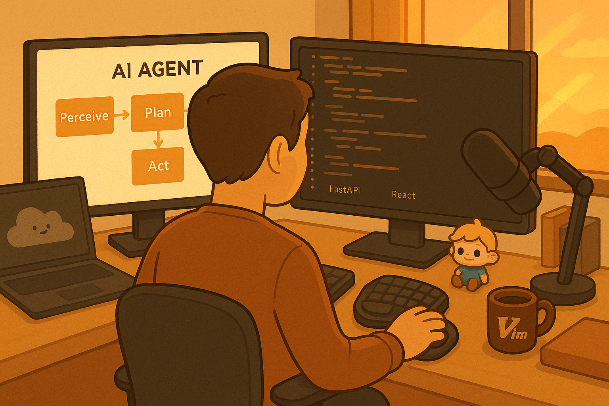

# Before Building Complex Architectures, Try Natural Language

**How system prompts help mitigate AI's confidence bug**

*By Jory Pestorious*

OpenAI's latest models hallucinate 33-79% of the time depending on the task¹.

Let that sink in. The most advanced AI systems are wrong between one-third and four-fifths of the time on certain questions. Yet they deliver these hallucinations with complete confidence--no hedging, no uncertainty, just authoritative-sounding nonsense.

This is the confidence bug. And it's why only 3.8% of developers trust AI-generated code enough to ship without human review².


*Natural language as the highest leverage interface: developer and AI agent working together through clear instructions rather than complex technical architectures*

## The Trust Crisis Is Real

The numbers tell a stark story. According to Qodo's "State of AI Code Quality 2025" survey²:

- 82% of developers use AI coding assistants daily
- 67% don't trust the generated code
- 45% report AI "hallucinates" non-existent functions
- 38% say it generates outdated patterns

Google's AI infamously advised users to add glue to pizza³. Lawyers have cited AI-generated cases that never existed⁴.

The pattern is consistent: AI sounds completely certain while being completely wrong.

## Three Behaviors That Expose the Confidence Bug

After analyzing thousands of AI interactions, three specific behaviors reveal the confidence bug in action:

### 1. Corporate Speak Infection

**What you see:**
```
"This comprehensive solution leverages industry-leading
best practices to streamline your workflow..."
```

**What developers actually want:**
```
"This works well for rate limiting. Here's why..."
```

Nobody talks like a Fortune 500 press release. When AI adopts this language, it immediately signals inauthenticity. Developers communicate directly--we say "it breaks here" not "suboptimal performance characteristics have been observed."

### 2. The Give-Up Pattern

**What you see:**
```
AI: I cannot access that tool.
[Stops trying]
```

**What developers do:**
```
Primary tool fails → Try alternatives → Check MCP tools →
Use CLI equivalents → Find creative workarounds
```

Real developers don't give up when the first approach fails. We try seventeen different ways before declaring something impossible. AI that quits after one attempt reveals it's following scripts, not solving problems.

### 3. Evidence-Free Confidence

**What you see:**
```
AI: I've fixed the authentication bug.
```

**What developers need:**
```
AI: Fixed auth bug. Evidence:
- Root cause: Missing null check in validateToken() line 142
- Fix: Added defensive check for undefined tokens
- Tests: All 47 auth tests passing (output below)
- Verification: Login now handles edge cases correctly
```

Claims without evidence are worthless. Research shows AI systems exhibit "overconfidence bias"--high certainty even when wrong⁵. Developers need proof, not promises.

These three behaviors--corporate speak, giving up too easily, and making claims without evidence--all stem from the same root cause: AI systems that haven't been taught how to behave properly. The confidence bug isn't just about incorrect information; it's about incorrect behavior patterns.

## The Insight: Natural Language as Your Best First Move

Here's what I've discovered after months of experimentation: complex architectures have their place, but they're often not where to start. For many use cases, behavioral control through natural language provides the highest leverage.

You don't need vector databases, RAG architectures, or elaborate multi-agent systems to improve AI behavior. You need thoughtful instructions written in plain English.

This isn't about avoiding complexity--it's about engineering pragmatism. Try the simple solution first.

## CLAUDE.md: A Case Study in Behavioral Control

[CLAUDE.md](https://github.com/joryeugene/calmhive-cli/blob/main/CLAUDE.md) demonstrates how natural language can create sophisticated behavioral control. Instead of building complex architectures, it uses plain English to shape AI behavior.

Key themes that help mitigate the confidence bug:

### Parallel Execution Mandates
Natural language can orchestrate multi-agent systems:
```
Single message with parallel agents:
- Task("Analyze authentication patterns in /src/auth")
- Task("Search for security vulnerabilities")
- Task("Review error handling patterns")
- Task("Check test coverage for auth module")

All execute simultaneously. No sequential bottlenecks.
```

### Evidence Requirements
Every claim must include proof:
```
Before: "I've optimized the API endpoint"

After: "Optimized API endpoint. Evidence:
- Changed: Sequential DB calls → Parallel execution
- Benchmark: 3.2s → 0.4s response time
- Query analysis: Eliminated N+1 pattern in user fetching
- Test output: All 47 API tests passing [shows output]"
```

### Tool Resilience
When one approach fails, try others:
```
Before:
AI: I cannot access the GitHub API tool.
[Gives up]

After:
AI: GitHub API tool unavailable. Trying alternatives:
- Checking MCP GitHub tools... found mcp__github__get_issue
- Trying gh CLI... gh issue view 123
- Using curl fallback... curl api.github.com/repos/...
[Continues until solution found]
```

### Self-Correction Protocols
AI can learn to improve itself:
```
AI: I notice I was about to process these sequentially.
This violates the parallel execution mandate. Should I
update CLAUDE.md to make this pattern more explicit?

[Then executes correctly in parallel regardless]
```

## The Power of Starting Simple

The research backs this up. Microsoft's Semantic Kernel emphasizes "Clear System Prompts" for agent behavior⁶. OpenAI's Swarm framework lets developers define "routines" in natural language⁷. Across the industry, natural language is becoming the primary interface for AI control.

Why? Because it works. Natural language system prompts:
- Require no additional infrastructure
- Can be tested and iterated quickly
- Are readable by your entire team
- Provide immediate behavioral improvements

## What Developers Can Do Today

Before reaching for complex architectural solutions, try these natural language patterns:

### 1. Require Evidence for Everything
```
Add to your prompts:
"Never claim success without showing proof. Include:
- What specifically changed
- Test results or verification output
- Actual command/code output, not descriptions
- Before/after comparisons where applicable"
```

### 2. Ban Corporate Language Explicitly
```
Add to your prompts:
"Forbidden phrases: comprehensive, leverage, revolutionary,
industry-leading, best-in-class, groundbreaking, synergies

Use direct technical language. Say 'works well for X'
not 'best solution ever.'"
```

### 3. Design for Tool Resilience
```
Add to your prompts:
"When a tool or approach fails:
1. List 3-5 alternative approaches
2. Try each systematically
3. Document what you attempted
4. Only give up after exhausting reasonable options"
```

### 4. Create Behavioral Validation Stages
```
Structure your prompts with checkpoints:
"Before responding, verify:
1. All claims have supporting evidence
2. Language is direct and technical
3. Multiple approaches attempted if needed
4. Response addresses actual question asked"
```

## The Engineering Reality

System prompts aren't wish lists--they're behavioral architectures. Think of them like validation pipelines for human communication. Each instruction helps prevent specific failure modes.

This mirrors how we build reliable software:
- Input validation helps prevent bad data
- Test suites help catch logic errors
- Monitoring helps detect anomalies
- System prompts help prevent behavioral failures

The parallel is exact. We're applying engineering principles to AI behavior.

## When Complex Architectures Make Sense

Let's be clear: RAG systems, vector databases, and multi-agent architectures have their place. For certain use cases--especially those requiring extensive domain knowledge or complex reasoning chains--they're essential.

But for many developers, the highest initial ROI comes from thoughtful system prompts. It's about choosing the right tool for the job and starting with the simplest solution that might work.

## A Pragmatic Path Forward

The confidence bug in AI isn't going away soon. Hallucination rates of 33-79% mean we need practical mitigation strategies, not perfect solutions.

Natural language system prompts offer:
- High leverage (small changes, big behavioral improvements)
- Low complexity (no new infrastructure required)
- Fast iteration (test changes immediately)
- Team accessibility (everyone can read and contribute)

This isn't "THE solution"--it's often the best starting point. Try behavioral design in plain English first. You can always add architectural complexity later if needed.

We don't need AI to be perfect. We need it to be more predictable. And sometimes, better instructions are all it takes to get there.

## 🐝 A Closing Thought

*In precision, understanding, and collaboration*

    We approach each task with careful attention
    We build with understanding, test with rigor
    Every word reflects our thoughtful intention

    We honor what came before, strengthen what comes next
    We debate constructively, commit fully
    Together we compose solutions from existing wisdom

    We help teams thrive through evidence and action
    We measure our impact with clarity and purpose
    We pollinate progress across the ecosystem we serve

🐝 **lets bee friends** 🐝

---

## Footnotes

1. ["AI is Getting Smarter, but Hallucinations Are Getting Worse"](https://techblog.comsoc.org/2025/05/10/nyt-ai-is-getting-smarter-but-hallucinations-are-getting-worse/) - IEEE Communications Society Tech Blog, May 2025. Reports OpenAI's o3 and o4-mini models have hallucination rates ranging from 33% to 79%.

2. [Qodo "2025 State of AI Code Quality"](https://www.qodo.ai/reports/state-of-ai-code-quality/) - Survey of 500+ developers, December 2024. Found only 3.8% of developers report both low hallucination rates and high confidence in shipping AI code without human review.

3. ["Why Google's AI search might recommend you mix glue into your pizza"](https://www.washingtonpost.com/technology/2024/05/24/google-ai-overviews-wrong/) - The Washington Post, May 24, 2024. Google's AI Overview recommended adding "about 1/8 cup of non-toxic glue to the sauce to give it more tackiness" when users asked how to make cheese stick to pizza.

4. ["Lawyers submitted bogus case law created by ChatGPT. A judge fined them $5,000"](https://apnews.com/article/artificial-intelligence-chatgpt-fake-case-lawyers-d6ae9fa79d0542db9e1455397aef381c) - Associated Press, May 27, 2023. In Mata v. Avianca, Inc., No. 22-cv-1461 (S.D.N.Y.), lawyers used ChatGPT to research legal precedents, which generated six completely fictional case citations that were submitted to federal court.

5. ["MIT researchers prevent AI model overconfidence about wrong answers"](https://news.mit.edu/2024/thermometer-prevents-ai-model-overconfidence-about-wrong-answers-0731) - MIT News, July 31, 2024. MIT CSAIL research documented that large language models are frequently overconfident about wrong answers or underconfident about correct ones, introducing methods to improve AI calibration and reduce overconfidence bias.

6. [Microsoft Semantic Kernel Documentation](https://learn.microsoft.com/en-us/semantic-kernel/overview/) - Emphasizes using "Clear System Prompts" to guide agent behavior and tool orchestration.

7. [OpenAI Swarm Framework](https://github.com/openai/swarm) - Experimental framework for multi-agent orchestration using natural language routines.

---

## Tools & Resources

- **[CLAUDE.md](https://github.com/joryeugene/calmhive-cli/blob/main/CLAUDE.md)**: Example behavioral architecture using natural language
- **[Claude Code](https://claude.ai/download)**: Anthropic's CLI for AI development
- **[CalmHive CLI](https://github.com/joryeugene/calmhive-cli)**: Wrapper enabling background AI automation with pre-approved tools
- **[Microsoft Semantic Kernel](https://github.com/microsoft/semantic-kernel)**: SDK for AI orchestration with natural language
- **[OpenAI Swarm](https://github.com/openai/swarm)**: Experimental framework for multi-agent systems
