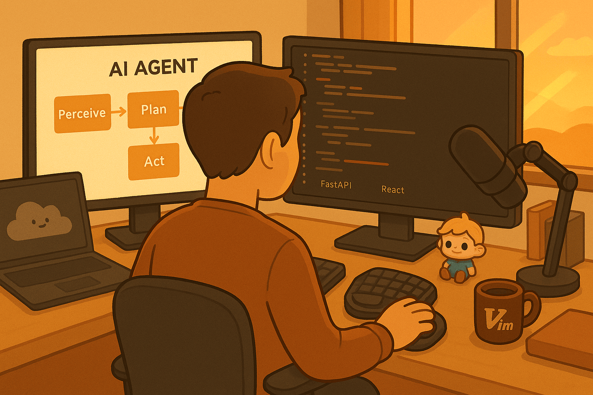

# Before Adding Agent Architecture, Try Plain Instructions

**Use plain-language rules for observable behavior, then test whether the behavior changed.**

*By Jory Pestorious | December 1, 2025 | Archive note added August 12, 2026*

> **Archive note, August 12, 2026:** The original article treated hallucination, incorrectness, confidence calibration, prompt compliance, and agent behavior as one “confidence bug.” They are different problems. I narrowed the article to what its examples support: instructions are a cheap first intervention for behavior you can observe, but they do not replace retrieval, tests, permissions, state, or evaluation. I also pinned the moving `CLAUDE.md` reference and replaced secondary benchmark reporting with primary sources.


Plain instructions can define a behavior without proving that the model will follow it.

## Start with the failure you can see

After months of writing rules for Claude Code, I keep finding problems that do not need a new service first. The agent may declare success before running tests or stop after one tool fails. Another answer may bury a direct response in corporate language. Each failure is visible enough to describe in one instruction and score in the next run.

An instruction file is the cheapest place to start. I can change a sentence, rerun the same task, and inspect the output without adding a vector database, retrieval pipeline, or another agent. The instruction does not make the model truthful. The instruction gives the evaluation a behavior to check.

## Keep the failure classes separate

OpenAI's April 2025 [o3 and o4-mini system card](https://deploymentsafety.openai.com/o3/appendix#hallucinations) reports hallucination rates on two fact-seeking evaluations. On PersonQA, o3 scored 33 percent and o4-mini scored 48 percent. On SimpleQA, the rates were 51 and 79 percent. The four rates describe particular models, datasets, and scoring rules. They do not measure whether a response sounds certain or whether a system prompt changes the result.

Hallucination is fabricated or unsupported content. Incorrectness is broader. Calibration concerns whether expressed confidence matches observed accuracy. The [Thermometer paper](https://arxiv.org/abs/2403.08819) treats calibration as its own problem and trains an auxiliary model across tasks.

Prompt compliance asks whether the model follows an instruction. Tone, tool fallback, evidence reporting, and task order are observable behaviors. Changing one does not establish an improvement in the others.

## What my instruction file asks for

The publication-era [`CLAUDE.md`](https://github.com/joryeugene/calmhive-cli/blob/2cd9ad26ffe3903a4005c2fc143a45345c62800a/CLAUDE.md) asks the agent to show command output, before-and-after comparisons, tests, and specific measurements before declaring completion. The file also asks for direct language, parallel work when tasks are independent, and correction when the agent notices that it is about to violate a rule.

The file contains requests, not results. For an evidence rule, the useful test is whether the agent runs the relevant check and reproduces its output. A polished sentence that says “all tests pass” can still be fabricated. The verifier must inspect the command, output, exit status, and changed behavior. I start with four rules because each has a visible pass condition.

### Require completion evidence

```text
Do not claim that the task is complete until you show:
- the exact change
- the relevant command and exit status
- the output that verifies the changed behavior
- the largest remaining gap
```

### Continue after a tool failure

```text
If one tool fails, state the failure and try an available equivalent.
Stop when the alternatives would change scope, require new permission,
or risk damaging data.
```

### Name the language to remove

```text
Avoid comprehensive, revolutionary, industry-leading, and best-in-class.
Name the actor, action, evidence, and limitation in direct language.
```

### Correct the current action

```text
When you notice a rule violation, identify it, correct the current work,
and suggest a durable instruction change. Do not call the suggestion
learning until a later run shows that the behavior changed.
```

## Instructions still need a runtime

OpenAI's archived [Swarm](https://github.com/openai/swarm/tree/0c82d7d868bb8e2d380dfd2a319b5c3a1f4c0cb9) makes the boundary visible. An agent has instructions and functions. Swarm converts the active instructions into a system prompt, while its run loop executes tool calls, handles handoffs, updates context variables, and returns when no new function calls remain. The natural-language instruction describes behavior; code performs the orchestration.

Swarm also tells developers to bring evaluation suites. Swarm's guidance is the right posture for any instruction file. A rule earns its place when a repeated task shows that it changes the target behavior without reducing correctness elsewhere.

For a small comparison, hold the model, task set, repository state, tools, and settings constant. Run the tasks without the new rule, add one rule, then run them again. Score the behavior named by the rule and the correctness of the final result.

A tone rule needs a tone check. A tool-fallback rule needs recorded failures and alternatives. An evidence rule needs real commands and outputs. None of those scores can stand in for a hallucination or calibration evaluation.

## Know when an instruction is the wrong layer

Use retrieval when the model needs private or changing facts. Use storage when work must survive between runs. Use schemas and programmatic checks when the output must be deterministic. Use explicit permission controls around consequential tools. Use tests and independent review for correctness. Add orchestration when one prompt and one tool loop cannot reliably represent the workflow.

Plain instructions are useful because they are cheap to change and easy for a team to read. Start with one when the failure is observable in the agent's behavior. Keep it when the comparison shows an improvement. Build another layer when the failure is knowledge, state, permissions, deterministic validation, or execution.

**lets bee friends**

**Sources:** [OpenAI o3 and o4-mini system card](https://deploymentsafety.openai.com/o3/appendix#hallucinations) | [Thermometer paper](https://arxiv.org/abs/2403.08819) | [pinned `CLAUDE.md`](https://github.com/joryeugene/calmhive-cli/blob/2cd9ad26ffe3903a4005c2fc143a45345c62800a/CLAUDE.md) | [OpenAI Swarm](https://github.com/openai/swarm/tree/0c82d7d868bb8e2d380dfd2a319b5c3a1f4c0cb9)
