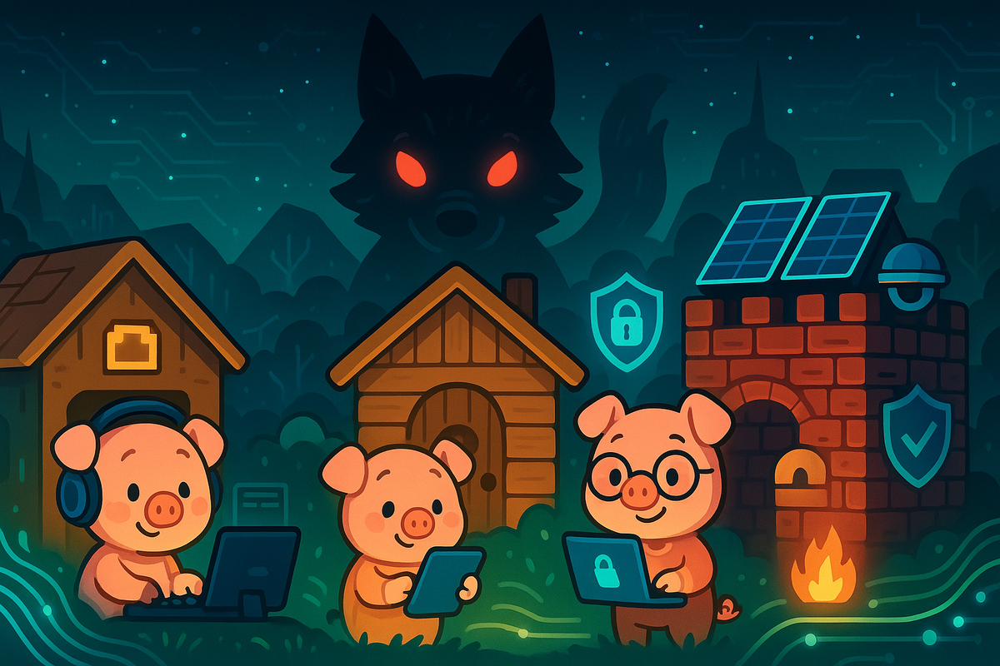

# The Three Little Pigs and the Digital Revolution

Once upon a time, in a valley where fiber optic cables ran alongside babbling brooks, there lived three little pigs who had grown tired of their cramped apartment in the city. Each pig had inherited a small plot of land from their grandmother, and they decided it was time to build their own homes.

The first little pig, named Pixel, was always in a hurry. He wanted to build his house as quickly as possible so he could get back to streaming his favorite shows. He gathered some old cardboard boxes from behind the electronics store and built himself a house in just one afternoon. *"Perfect!"* he squealed, as he set up his gaming setup inside. *"Now I can get back to my online tournaments!"*

The second little pig, named Parser, was more thoughtful but still wanted to finish quickly. He collected some wooden pallets from the shipping dock and built a modest house over the weekend. *"This should last a while,"* he said, installing his smart home devices throughout. *"And I've got Wi-Fi in every room!"*

The third little pig, named Patch, was the most careful of the three. She spent weeks researching building materials, reading reviews, and planning her construction. She gathered strong bricks, reinforced them with steel, and even installed solar panels on the roof. Her brothers laughed at how long it was taking. *"You're overthinking it, Patch!"* they called out. But she just smiled and continued her meticulous work.

One day, a Big Bad Wolf appeared in the valley. But this wasn't just any wolf – this was a cyber wolf, armed with malware, phishing attacks, and social engineering tricks. He had heard about the three little pigs and their connected homes.

First, he visited Pixel's cardboard house. *"Little pig, little pig, let me come in!"* he howled, sending a suspicious email attachment.

*"Not by the hair on my chinny-chin-chin!"* Pixel replied. *"I won't click your sketchy links!"*

But the wolf laughed. *"Then I'll huff, and I'll puff, and I'll hack your house in!"* With a simple DDoS attack, he overwhelmed Pixel's flimsy router, and the whole cardboard house collapsed into digital chaos. Pixel barely escaped with his laptop, running to his brother Parser's house.

The wolf soon arrived at the wooden pallet house. *"Little pigs, little pigs, let me come in!"*

*"Not by the hairs on our chinny-chin-chins!"* they replied together.

*"Then I'll huff, and I'll puff, and I'll break your firewalls in!"* The wolf launched a more sophisticated attack, exploiting vulnerabilities in Parser's hastily configured smart devices. The wooden house couldn't withstand the assault, and both pigs fled to their sister's brick house.

When the wolf arrived at Patch's house, he was confident. *"Little pigs, little pigs, let me come in!"*

*"Not by the hairs on our chinny-chin-chins!"* all three pigs shouted.

*"Then I'll huff, and I'll puff, and I'll hack your house in!"* The wolf unleashed his most powerful attacks – ransomware, zero-day exploits, and advanced persistent threats. But Patch's house was different. She had installed multiple layers of security: firewalls, intrusion detection systems, regular security updates, and even an air-gapped backup system. Her solar panels kept everything running independently.

The wolf huffed and puffed until he was exhausted, his malware bouncing harmlessly off Patch's hardened defenses. But he wasn't finished yet. In desperation, he tried one final gambit – a massive botnet attack, calling in every compromised device in his network. The assault was so fierce that even neighboring houses lost power.

But Patch's solar panels hummed quietly, her systems running cool and steady. Her intrusion detection system began analyzing the attack patterns in real-time, learning and adapting. Then something remarkable happened – her security system didn't just defend, it began to trace back through the wolf's network, systematically dismantling his botnet piece by piece.

*"No!"* howled the wolf as he watched his digital empire crumble. *"This is impossible!"*

*"Nothing's impossible when you build properly from the ground up,"* Patch called out through her intercom. ***"You taught yourself to destroy, but I taught myself to build. And what's built right can't be torn down wrong."***

The wolf's own devices turned against him. His attack tools became trapped in Patch's honeypots. His stolen data got encrypted with keys he'd never crack. As his last server went dark, he found himself locked out of his own systems, reduced to nothing more than an ordinary wolf with an ordinary computer.

He slunk away into the digital wilderness, not defeated but utterly dismantled, his threat neutralized permanently.

The valley was safe, but more than that – word spread of what Patch had built. Other animals came to learn from her, and soon the entire valley became a fortress of proper digital hygiene. Pixel and Parser didn't just rebuild their homes; they became cybersecurity advocates, teaching others the hard-won lessons they'd learned.

As for the wolf? Some say he eventually found honest work in IT support, helping others secure their systems against threats like his former self. Whether that's true or not, one thing was certain: he never threatened anyone's bacon again.

**The valley flourished, protected not by fear or walls, but by knowledge, preparation, and the kind of security that only comes from building things right the first time.**

#### The End
