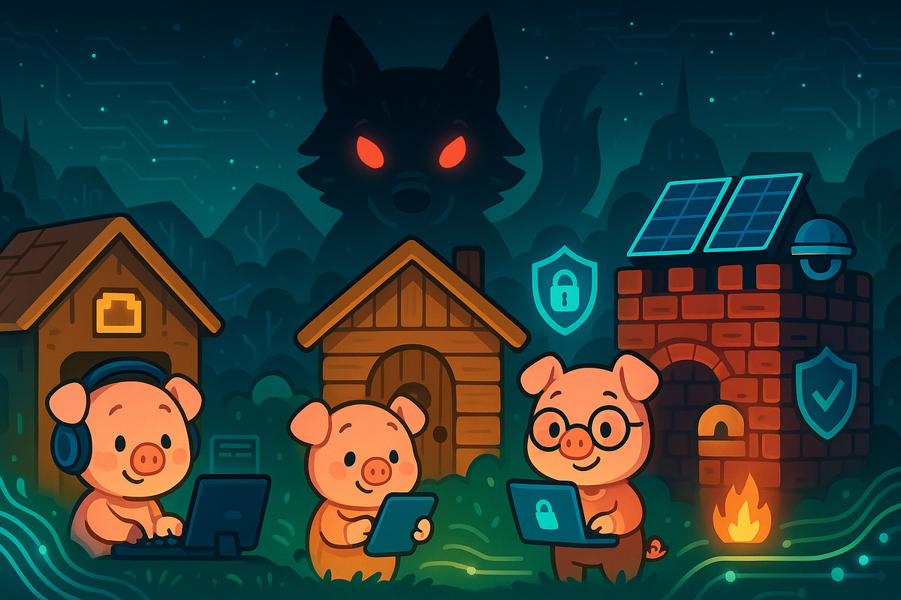

# The Three Little Pigs and the Digital Revolution

Once upon a time, in a valley where fiber optic cables ran alongside babbling brooks, there lived three little pigs who had grown tired of their cramped apartment in the city. Each pig had inherited a small plot of land from their grandmother, and they decided it was time to build their own homes.

The first little pig, named Pixel, was always in a hurry. He wanted to build his house as quickly as possible so he could get back to streaming his favorite shows. He gathered some old cardboard boxes from behind the electronics store and built himself a house in just one afternoon. *"Perfect!"* he squealed, as he set up his gaming rig inside. *"Now I can get back to my online tournaments!"*

The second little pig, named Parser, was more thoughtful but still wanted to finish quickly. He collected some wooden pallets from the shipping dock and built a modest house over the weekend. *"This should last a while,"* he said, installing his smart home devices throughout. *"And I've got Wi-Fi in every room!"*

The third little pig, named Patch, was the most careful of the three. She spent weeks researching building materials, reading reviews, and planning her construction. She gathered strong bricks, reinforced them with steel, and even installed solar panels on the roof. Her brothers laughed at how long it was taking. *"You're overthinking it, Patch!"* they called out. But she just smiled and continued her meticulous work.

One day, a Big Bad Wolf appeared in the valley. He was a cyber wolf, armed with malware, phishing attacks, and social engineering tricks. He had heard about the three little pigs and their connected homes.

First, he visited Pixel's cardboard house. *"Little pig, little pig, let me come in!"* he howled, sending a suspicious email attachment.

*"Not by the hair on my chinny-chin-chin!"* Pixel replied. *"I won't click your sketchy links!"*

But the wolf laughed. *"Then I'll huff, and I'll puff, and I'll hack your house in!"* His botnet flooded Pixel's internet connection until the games and cameras went offline. The router still had power, but the connected home no longer worked. Pixel grabbed his laptop and ran to his brother Parser's house.

The wolf soon arrived at the wooden pallet house. *"Little pigs, little pigs, let me come in!"*

*"Not by the hairs on our chinny-chin-chins!"* they replied together.

*"Then I'll huff, and I'll puff, and I'll break your firewalls in!"* The wolf launched a more sophisticated attack, exploiting vulnerabilities in Parser's hastily configured smart devices. The wooden house couldn't withstand the assault, and both pigs fled to their sister's brick house.

When the wolf arrived at Patch's house, he was confident. *"Little pigs, little pigs, let me come in!"*

*"Not by the hairs on our chinny-chin-chins!"* all three pigs shouted.

*"Then I'll huff, and I'll puff, and I'll hack your house in!"* The wolf tried phishing, ransomware, an unknown device exploit, and another botnet flood. Patch had kept her router and devices updated, put the smart devices on a separate network, limited exposed services, and stored a [tested offline backup](https://www.nist.gov/news-events/news/2021/05/nist-releases-tips-and-tactics-dealing-ransomware).

Those layers did not make the attacks harmless. Her intrusion detection alerts showed suspicious traffic, and the separate network limited what one compromised device could reach. When the botnet saturated the valley's upstream connection, neighboring houses lost internet access too. Patch's [solar panels, battery, and island-capable inverter](https://www.energy.gov/cmei/systems/solar-and-resilience-basics) kept her local systems powered, but they could not restore the upstream connection.

Patch isolated the affected devices and preserved their logs. Her honeypot recorded the wolf's attempts without reaching beyond her own network. She called her internet provider, which [filtered the attack upstream](https://www.cisa.gov/ncas/alerts/ta14-017a), and reported the incident. After checking that the affected devices were clean, she restored the damaged data from her offline backup.

*"No!"* howled the wolf as Patch's services came back. *"This is impossible!"*

*"You taught yourself to destroy, but I taught myself to build,"* Patch called out through her intercom.

Patch never accessed a computer she did not own. The provider blocked the malicious traffic, and the logs gave investigators evidence they could use. The wolf slunk into the digital wilderness, frustrated and still dangerous, while the pigs repaired the damage.

Other animals separated vulnerable devices, installed updates, tested their backups, and wrote down whom to call during an incident. Pixel and Parser rebuilt their homes and taught those practices to their neighbors.

Some say the wolf eventually found honest work in IT support, helping others secure their systems against threats like his former self. Whether that's true or not, one thing was certain: he never threatened anyone's bacon again.

#### The End
