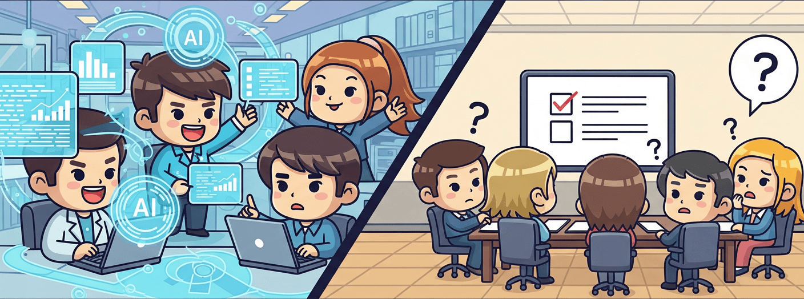

# The AI Gap: Why Leaders Struggle to Equip Their Engineers

*By Jory Pestorious*

> "I don't really like AI."

An AI leader confided at a weekend gathering: "I don't really like AI." They lead AI initiatives for a major enterprise, caught between engineers asking for advanced tools and their own uncertainty about what's truly needed. It's a position many leaders find themselves in--responsible for decisions about technology they struggle to evaluate.

That moment crystallized what I call **"the AI gap"**--not the widely discussed skills shortage or talent crisis, but something more fundamental: the disconnect between AI tools engineers need to do their best work and what organizations actually provide them.

Everyone talks about the AI skills gap. But there's another gap hiding in plain sight: talented engineers who know what's possible with AI, constrained by tools that don't match their ambitions.

Those engineers might be using Claude on personal accounts right now. Not because they're rebels, but because they're doing what they were hired to do: deliver the best possible solutions with the best available tools. And while they do, your competitors with better AI tools ship faster.

*The gap between what's possible and what's permitted keeps widening.*

*A cartoon contrast: Enthusiastic engineers use AI on one side; confused individuals stare at checkboxes on the other.*

## The AI Gap in Practice

Companies spend months recruiting engineers who can *"transform our technology stack"* and *"bring fresh thinking to legacy problems."* They pay top dollar for people who won't accept *"that's how we've always done it."*

Then they provide basic AI coding tools and consider their AI strategy complete.

This gap is jarring. Engineers know `CLAUDE.md` files could capture years of tribal knowledge. They've seen demonstrations of custom `/commands` that turn complex workflows into simple patterns. They understand MCP tools can connect AI to development environments with appropriate permissions and access controls.

Instead, they get basic code completion and lengthy approval processes for anything more powerful.

**The AI gap** creates what I call **"innovation pressure"**--that grinding tension between what engineers know is possible and what they're allowed to use. It's not rebellion. It's professionals who want to ship quality code efficiently, stuck with tools that make simple tasks take longer than necessary.

## Measuring the Gap

Let me break down what's actually available today:

**What Most Engineers Get:**
- Basic code completion that doesn't understand your architecture
- IDE-integrated AI assistants with limited context
- AI chat interfaces completely disconnected from your actual workflow
- Some AI-powered code review tools that miss domain-specific issues
- Maybe a corporate-approved LLM with heavy restrictions

**What's Actually Possible:**
- Living documentation that captures institutional knowledge automatically
- Custom commands that encode complex workflows (`/deploy-staging`, `/frontend-testing`)
- Transparent reasoning where you can see exactly how problems get solved
- AI that securely integrates with full codebases, APIs, and databases
- Parallel AI agents that execute complex multi-step workflows across cloud environments

> This gap isn't incremental--it's exponential. When engineers get tools that actually understand their codebase, the productivity gains are dramatic. Bugs that took days become hour-long fixes. Documentation stays current automatically. Junior engineers contribute more effectively.

## The Impact of Ignoring This Gap

Here's what becomes possible when engineers get real AI tools:

**Development Speed:**
When AI can trace through complex logic flows, debugging becomes faster--though specific improvements vary by codebase and team.

**Knowledge Preservation:**
AI-powered documentation can reduce repetitive questions, freeing senior engineers to focus on high-value work.

**Team Dynamics:**
Junior engineers ramp up faster when AI embodies team best practices.

**Engineering Satisfaction:**
Many engineers prefer having autonomy over their tool selection, though individual preferences vary.

**Competitive Disadvantage:**
While you debate tool approval, competitors with better AI tools ship faster and your engineers notice.

## Why Organizations Resist Closing the Gap

Common concerns include:

***"Security and Compliance."***
Modern AI platforms offer enterprise security features including SOC 2 compliance, data isolation, and audit logging. Yes, regulated industries face unique challenges--which is why you need rigorous measurement to ensure both security AND productivity. Shadow IT emerges when official tools don't meet needs, creating unmeasured risk.

***"We need governance."***
> Sure. But perfect governance of mediocre tools still produces mediocre results. The goal should be governed excellence, not governed mediocrity.

***"Change management is hard."***
You know what's harder? Keeping good engineers when competitors offer them dramatically better tools. The market for engineering talent is competitive enough without undermining your team.

***"It's expensive."***
The investment varies by team size and tool selection. What matters is measuring actual impact. When AI tools save engineers even a few hours weekly, the productivity gains scale dramatically. For a 1000-engineer organization, even conservative time savings can represent significant value. The key is tracking real metrics, not hypothetical ROI.

***"We need external validation."***
Smart organizations use data-driven assessments to validate their AI investments. The best assessment partners don't just theorize--they measure actual usage patterns, identify high-value vs. low-value applications, and track productivity changes over time. Look for partners who bring measurement frameworks, not just opinions.

## Understanding Valid Concerns

Not all resistance stems from fear or ignorance. Leaders who express caution often see risks engineers might miss:

- **Data exposure** in regulated industries
- **Vendor dependencies** that could become technical debt
- **Budget impact** when scaling across large teams
- **Integration complexity** with existing systems

The key is distinguishing between concerns that need addressing and theater that needs challenging.

## Closing the Gap

Forget the buzzwords and frameworks. Here's the straightforward path:

1. **Ask your engineers what tools they're already using.** The answer might surprise you.

2. **Run a real pilot.** Not a checkbox exercise. Give a team the tools they actually want for 30 days. Measure what happens--with actual metrics, not feelings.

3. **Create collaborative decision-making.** Pair those exploring AI possibilities with engineers who've already integrated these tools into their workflow. Practical experience beats theoretical knowledge every time.

4. **Choose measurement-driven transformation over checkbox exercises.** The best assessments don't just identify gaps--they quantify opportunities and track real impact over time.

5. **Make the partnership real.** You hired transformation agents--give them transformative tools and trust their judgment. The organizations that figure this out will see meaningful competitive advantages.

## The Bottom Line

The AI leader who admitted they "don't like AI" showed remarkable honesty. Many leaders share this uncertainty--caught between the pressure to adopt AI and the challenge of understanding what actually works.

**The path forward isn't about blind adoption or theatrical assessments. It's about understanding.**

Understanding starts with measurement. What tools are your engineers actually using? Which AI applications drive real value versus checkbox compliance? How do you separate hype from measurable impact?

The AI gap is real, but it's not insurmountable. Bridging it requires:
- Honest conversations between leaders and engineers
- Data-driven decisions instead of fear-based restrictions  
- Measurement frameworks that track actual usage and impact
- Recognition that different organizations have different needs

**Your engineers know what tools could transform their work. The question is whether your organization is ready to measure, understand, and act on that knowledge.**

---

Example of a simple but powerful AI tool stack your engineers might be requesting:

- [Claude Code](https://docs.anthropic.com/en/docs/claude-code)--Professional AI development
- [CLAUDE.md example](https://github.com/joryeugene/calmhive-cli/blob/main/CLAUDE.md)--Living documentation in action
- [Sequential thinking tools](https://github.com/spences10/mcp-sequentialthinking-tools)--Transparent AI reasoning
- [Model Context Protocol](https://modelcontextprotocol.io/)--Connect AI to your environment
- [MCP tools collection](https://github.com/modelcontextprotocol/servers)--Explore the ecosystem
